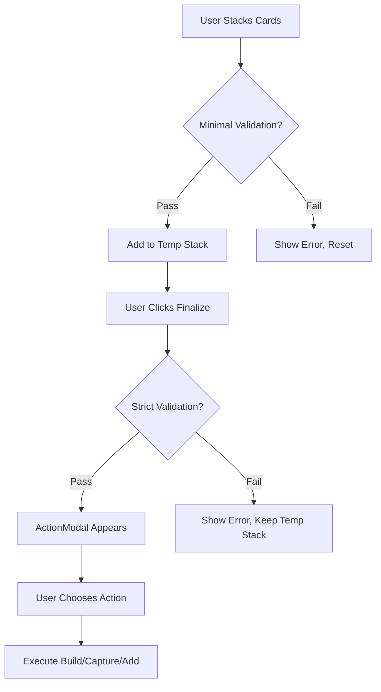

# Casino Game Logic and Rules Documentation

## Overview

This document explains the complete logic and rules for the casino card game's temporary stacking system, including card combination validation, build creation, capturing, and the ActionModal flow that presents players with choices for finalizing their temp stacks.

## Table of Contents

1. [Game Fundamentals](#game-fundamentals)
2. [Temp Stack System](#temp-stack-system)
3. [Card Combination Rules](#card-combination-rules)
4. [Validation Logic](#validation-logic)
5. [ActionModal Flow](#actionmodal-flow)
6. [Build vs Capture vs Add Decisions](#build-vs-capture-vs-add-decisions)
7. [Implementation Details](#implementation-details)

## Game Fundamentals

### Basic Rules
- Players can create temporary stacks by combining cards from their hand with cards on the table
- Temp stacks must contain at least one card from hand and one from table
- Players can add multiple cards to temp stacks before finalizing
- Finalization creates permanent builds that other players can capture or extend

### Card Values
- Number cards (2-10): Face value
- Face cards (J, Q, K): 10 points each
- Ace: 1 point

## Temp Stack System

### Creation Process

#### Phase 1: Flexible Stacking (Current Implementation)
```javascript
// In staging.js - validateStagingAddition()
// MINIMAL validation during stacking - allows experimentation
function validateStagingAddition(gameState, handCard, targetStack) {
  // ✅ Only essential checks:
  // - Card is in player's hand
  // - Basic ownership verification

  // ❌ NO combo validation during stacking
  // ❌ NO value restrictions during stacking

  return { valid: true }; // Allow flexible building
}
```

#### Phase 2: Strict Finalization (Current Implementation)
```javascript
// In finalizeStagingStack.js - validateStagingFinalization()
// FULL validation only when finalizing
function validateStagingFinalization(gameState, stack) {
  // ✅ Comprehensive validation:
  // - Ownership verification
  // - Card availability checks
  // - Minimum card requirements
  // - Combo validity checks (if implemented)

  return { valid: true/false, message: "Error details" };
}
```

### Stacking Workflow

```
1. Player drags card from hand to table card
   ↓
2. Temp stack created (minimal validation)
   ↓
3. Player can add more cards (minimal validation)
   ↓
4. Player clicks finalize button
   ↓
5. Strict validation performed
   ↓
6. If valid → ActionModal appears with options
   ↓
7. Player chooses: Build / Capture / Add to Build
   ↓
8. Permanent game state change
```

## Card Combination Rules

### Current Implementation Status

**The game currently allows flexible stacking** with validation deferred to finalization. However, **combo validation should be implemented** to ensure meaningful card combinations.

### Proposed Combo Validation Rules

#### 1. Sequence Combinations
```javascript
// Valid: 5, 6, 7, 8 (sequential)
function isValidSequence(cards) {
  const sorted = cards.sort((a, b) => a.value - b.value);
  for (let i = 1; i < sorted.length; i++) {
    if (sorted[i].value !== sorted[i-1].value + 1) {
      return false;
    }
  }
  return true;
}

// Examples:
// ✅ 5♠ + 6♠ + 7♠ + 8♠ (sequence of 4)
// ✅ 9♦ + 10♦ + J♦ (sequence of 3)
// ❌ 5♠ + 7♠ + 8♠ (missing 6)
```

#### 2. Set Combinations
```javascript
// Valid: Three or more cards of same value
function isValidSet(cards) {
  const firstValue = cards[0].value;
  return cards.every(card => card.value === firstValue);
}

// Examples:
// ✅ Three 9s: 9♠ + 9♦ + 9♣
// ✅ Four 5s: 5♠ + 5♦ + 5♣ + 5♥
// ❌ 9♠ + 9♦ + 8♣ (mixed values)
```

#### 3. Special Combinations
```javascript
// Marriage: King + Queen of same suit
function isMarriage(cards) {
  if (cards.length !== 2) return false;
  const [card1, card2] = cards;
  return card1.suit === card2.suit &&
         ((card1.rank === 'K' && card2.rank === 'Q') ||
          (card1.rank === 'Q' && card2.rank === 'K'));
}

// Examples:
// ✅ K♠ + Q♠ (marriage)
// ❌ K♠ + Q♦ (different suits)
// ❌ K♠ + J♠ (not king+queen)
```

#### 4. Value-Based Combinations
```javascript
// For stacking to specific totals (like 9)
function validateStackingToNine(existingCards, newCard) {
  const currentValue = existingCards.reduce((sum, c) => sum + c.value, 0);
  const newValue = currentValue + newCard.value;

  // Must total exactly 9
  if (newValue !== 9) {
    return { valid: false, reason: "Must total exactly 9" };
  }

  // Must form valid combination
  const allCards = [...existingCards, newCard];
  if (isValidSequence(allCards) || isValidSet(allCards)) {
    return { valid: true };
  }

  return { valid: false, reason: "Cards must form sequence or set" };
}
```

## Validation Logic

### Where Validation Occurs

#### 1. During Stacking (Minimal - Current)
```javascript
// staging.js - validateStagingAddition()
function validateStagingAddition(gameState, handCard, targetStack) {
  // ✅ ESSENTIAL checks only:
  const playerHasCard = playerHands[currentPlayer].includes(handCard);
  const basicOwnership = targetStack.owner === currentPlayer; // Currently relaxed

  if (!playerHasCard) {
    return { valid: false, message: "Card not in hand" };
  }

  // ❌ NO combo validation here (should be added)
  return { valid: true };
}
```

#### 2. During Finalization (Strict - Current)
```javascript
// finalizeStagingStack.js - validateStagingFinalization()
function validateStagingFinalization(gameState, stack) {
  // ✅ COMPREHENSIVE validation:
  const correctOwner = stack.owner === currentPlayer;
  const hasHandCards = stack.cards.some(c => c.source === 'hand');
  const hasTableCards = stack.cards.some(c => c.source === 'table');
  const minimumCards = stack.cards.length >= 2;
  const cardsAvailable = verifyCardAvailability(stack, playerHands);

  // Combo validation could be added here too
  const validCombination = validateCardCombination(stack.cards);

  if (!correctOwner || !hasHandCards || !hasTableCards || !minimumCards || !cardsAvailable) {
    return { valid: false, message: "Invalid stack configuration" };
  }

  return { valid: true };
}
```

### Proposed Enhancement: Combo Validation During Stacking

```javascript
// Enhanced validateStagingAddition() with combo checking
function validateStagingAddition(gameState, handCard, targetStack) {
  // Existing essential checks...

  // 🎯 NEW: Add combo validation for stacking to specific values
  const existingCards = targetStack.cards || [];
  const comboCheck = validateCardCombination([...existingCards, handCard]);

  if (!comboCheck.valid) {
    return {
      valid: false,
      message: `Invalid combination: ${comboCheck.reason}`
    };
  }

  return { valid: true };
}
```

## ActionModal Flow

### When ActionModal Appears

The ActionModal appears **after successful finalization validation** and presents players with choices for what to do with their temp stack.

```typescript
// useServerListeners.ts - buildOptions handling
useEffect(() => {
  if (buildOptions && buildOptions.options) {
    console.log('[GameBoard] Build options received:', buildOptions);

    // Create modal actions from server options
    const actions = buildOptions.options.map(option => {
      if (option.type === 'build') {
        return {
          type: 'createBuildWithValue',
          label: `Create Build (${option.payload.value})`, // e.g., "Create Build (9)"
          payload: {
            stack: buildOptions.stack,
            buildValue: option.payload.value
          }
        };
      } else if (option.type === 'capture') {
        return {
          type: 'executeCaptureFromStack',
          label: `Capture with ${option.payload.value}`, // e.g., "Capture with 9"
          payload: {
            stack: buildOptions.stack,
            targetCard: option.payload.targetCard,
            captureValue: option.payload.value
          }
        };
      }
    });

    setModalInfo({
      title: 'Choose Action',
      message: 'What would you like to do with this stack?',
      actions
    });
  }
}, [buildOptions, setModalInfo]);
```

### Modal Structure

```typescript
interface ActionModalProps {
  modalInfo: {
    title: string;
    message: string;
    actions: Array<{
      type: string;
      label: string;        // Display text like "Create Build (9)"
      payload?: any;        // Action data
    }>;
  };
  onAction: (action) => void;
  onCancel: () => void;
}
```

## Build vs Capture vs Add Decisions

### 1. Create Build Option
```javascript
// When: Stack value ≤ 10 and forms valid combination
// Action: createBuildWithValue
// Result: Creates new build on table that others can capture/extend
{
  type: 'createBuildWithValue',
  label: 'Create Build (9)',
  payload: {
    stack: tempStackData,
    buildValue: 9
  }
}
```

### 2. Capture Option
```javascript
// When: Stack value equals a capturable card value
// Action: executeCaptureFromStack
// Result: Captures target card and removes it from table
{
  type: 'executeCaptureFromStack',
  label: 'Capture 9♦ with stack',
  payload: {
    stack: tempStackData,
    targetCard: { rank: '9', suit: '♦' },
    captureValue: 9
  }
}
```

### 3. Add to Existing Build Option
```javascript
// When: Stack can extend existing build
// Action: addToExistingBuild
// Result: Adds cards to existing build, increasing its value
{
  type: 'addToExistingBuild',
  label: 'Add to Build #123',
  payload: {
    stack: tempStackData,
    targetBuildId: 'build-123'
  }
}
```

### Decision Logic

The server determines available options based on:

```javascript
function evaluateFinalizeOptions(stagingStack, tableCards, playerHand) {
  const options = [];
  const stackValue = calculateCardSum(stagingStack.cards);

  // 1. Check for build creation (value ≤ 10)
  if (stackValue <= 10) {
    options.push({
      type: 'build',
      label: `Create Build (${stackValue})`,
      payload: { value: stackValue }
    });
  }

  // 2. Check for captures (stack value matches table card values)
  const capturableCards = tableCards.filter(card =>
    !card.type && calculateCardValue(card) === stackValue
  );

  capturableCards.forEach(card => {
    options.push({
      type: 'capture',
      label: `Capture ${card.rank}${card.suit} (${stackValue})`,
      payload: {
        targetCard: card,
        value: stackValue
      }
    });
  });

  // 3. Check for build extensions
  const extendableBuilds = tableCards.filter(card =>
    card.type === 'build' &&
    card.buildValue + stackValue <= 10 &&
    card.owner !== currentPlayer // Can't extend own builds
  );

  extendableBuilds.forEach(build => {
    options.push({
      type: 'extend',
      label: `Add to Build (${build.buildValue} + ${stackValue})`,
      payload: {
        targetBuildId: build.buildId,
        newValue: build.buildValue + stackValue
      }
    });
  });

  return options;
}
```

## Implementation Details

### Current Architecture

```
Client Side:
├── TableCards.tsx (drag handling, z-index management)
├── LooseCardRenderer.tsx (card rendering)
├── CardStack.tsx (stack logic)
├── DraggableCard.tsx (gesture handling)
└── ActionModal.tsx (user choice interface)

Server Side:
├── staging.js (validation logic)
├── finalizeStagingStack.js (finalization handler)
├── actionDetermination.js (build/capture logic)
└── GameState.js (game state management)
```

### Validation Flow



### Proposed Enhancements

#### 1. Combo Validation During Stacking
```javascript
// Add to validateStagingAddition()
function validateStagingAddition(gameState, handCard, targetStack) {
  // Existing checks...

  // NEW: Combo validation for specific stacking goals
  const comboValidation = validateCardCombination(targetStack.cards, handCard);
  if (!comboValidation.valid) {
    return {
      valid: false,
      message: comboValidation.reason
    };
  }

  return { valid: true };
}
```

#### 2. Real-time Combo Feedback
```typescript
// In TableCards.tsx - show combo validity hints
const comboHint = useMemo(() => {
  const currentValue = tempStack.cards.reduce((sum, c) => sum + c.value, 0);
  const isValid = validateCombination(tempStack.cards);

  return {
    valid: isValid,
    message: isValid ? "Valid combination" : "Invalid combination",
    suggestions: isValid ? [] : getComboSuggestions(tempStack.cards)
  };
}, [tempStack.cards]);
```

#### 3. Progressive Validation
```javascript
// Validate as user builds, provide hints
const validationLevel = useMemo(() => {
  if (tempStack.cards.length < 2) return 'building';
  if (!validateBasicRules(tempStack.cards)) return 'invalid';
  if (!validateCombination(tempStack.cards)) return 'needs_work';
  return 'ready_to_finalize';
}, [tempStack.cards]);
```

## Summary

### Current System (As Implemented)
- ✅ **Flexible stacking** during creation (minimal validation)
- ✅ **Strict validation** only during finalization
- ✅ **ActionModal** appears after successful finalization
- ✅ **Build/Capture/Add options** presented to user
- ❌ **No combo validation** during stacking (should be added)

### Key Rules
1. **Temp stacks** need ≥1 hand card and ≥1 table card
2. **Finalization** requires all cards still available
3. **Builds** can be created (≤10 points) or captured (= exact value)
4. **Existing builds** can be extended by other players
5. **Invalid combinations** should be prevented during stacking

### Recommended Improvements
1. **Add combo validation** during stacking for better UX
2. **Real-time feedback** on combination validity
3. **Progressive validation** as user builds stacks
4. **Clear error messages** for invalid combinations

This system provides a solid foundation for casino-style card building with room for enhanced validation and user experience improvements.
