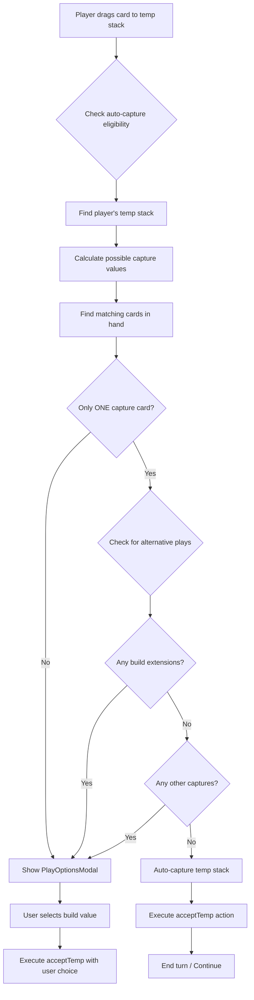

# Auto-Capture Smart Router Enhancement Plan

## Problem Statement

Currently, when a player drags a card onto their own temp stack, the PlayOptionsModal appears asking them to select a build value. This modal shows even when the player has no real choice - they have exactly one capture card in hand and no other legal plays.

**Example Scenario:**
- Player has created a temp stack with cards [5, 2] (sum = 7)
- Player has only ONE card in hand that can capture this stack: a 7
- No other valid plays exist (cannot extend/build, no other captures possible)
- Currently: Shows PlayOptionsModal with "Build 7" as the only option
- Desired: Automatically capture the temp stack since there's only one choice

## Solution Overview

Add intelligent detection in the frontend to identify when a player has exactly one capture option and no alternative plays. When these conditions are met, automatically execute the capture without showing the modal.

## Implementation Steps

### Step 1: Create Detection Logic Hook

Create a new hook `useAutoCaptureDetection.ts` in `hooks/game/` that analyzes the game state to determine if auto-capture should trigger.

```typescript
// hooks/game/useAutoCaptureDetection.ts
interface AutoCaptureResult {
  shouldAutoCapture: boolean;
  captureValue?: number;
  reason?: string;
}

/**
 * Analyzes game state to determine if auto-capture should trigger
 * 
 * Conditions for auto-capture:
 * 1. Player has a temp stack on the table
 * 2. Player has exactly ONE card in hand that can capture the temp stack
 * 3. No other valid plays exist (no builds to extend, no other captures)
 */
export function useAutoCaptureDetection(
  tempStack: TempStack | null,
  playerHand: Card[],
  tableCards: Card[],
  buildStacks: BuildStack[]
): AutoCaptureResult
```

### Step 2: Implement Detection Algorithm

The detection logic must:

1. **Check for temp stack existence**
   - Find player's active temp stack on table
   - If no temp stack, auto-capture doesn't apply

2. **Calculate possible capture values from temp stack**
   - Use existing `getBuildHint` utility to find target values
   - Example: [5, 2] → possible values: 7 (sum), 5 (same rank)

3. **Find matching cards in player's hand**
   - Filter player's hand for cards matching possible values
   - Count how many unique capture cards exist

4. **Check for alternative plays**
   - Check if any build extensions are possible
   - Check if any other captures are possible (loose cards, opponent builds)
   - If alternatives exist, don't auto-capture

5. **Determine auto-capture eligibility**
   - Only ONE capture card in hand AND
   - NO alternative plays available
   - → Trigger auto-capture

### Step 3: Add State Management

Update `useModalManager` or create new state in the game hook:

```typescript
// In useModalManager or useGameState
const [autoCapturePending, setAutoCapturePending] = useState(false);
const [pendingCaptureValue, setPendingCaptureValue] = useState<number | null>(null);
```

### Step 4: Integrate with Drag Handlers

Modify `useDragHandlers.ts` to check for auto-capture conditions:

```typescript
// In handleStackDrop or related handler
const autoCaptureResult = checkAutoCaptureEligibility(
  tempStack,
  playerHand,
  tableCards,
  buildStacks
);

if (autoCaptureResult.shouldAutoCapture) {
  // Execute capture immediately without showing modal
  await actions.acceptTemp(tempStack.id, autoCaptureResult.captureValue);
  return;
}

// Otherwise, show PlayOptionsModal as normal
```

### Step 5: Update PlayOptionsModal Integration

In the GameBoard or related component:

```tsx
// Before showing PlayOptionsModal, check auto-capture
const autoCapture = useAutoCaptureDetection(tempStack, hand, tableCards, builds);

useEffect(() => {
  if (autoCapture.shouldAutoCapture) {
    // Auto-capture without showing modal
    onConfirm(autoCapture.captureValue);
    return;
  }
  
  // Show modal normally
  openPlayModal();
}, [autoCapture]);

// In the modal's onConfirm handler
const handleConfirm = (buildValue: number, originalOwner?: number) => {
  actions.acceptTemp(stackId, buildValue, originalOwner);
  closePlayModal();
};
```

### Step 6: Add User Feedback (Optional)

Consider adding a subtle UI indicator when auto-capture triggers:

- Brief toast: "Auto-captured!" 
- Or subtle card animation showing the capture

## Data Structures

### TempStack Type
```typescript
interface TempStack {
  id: string;
  owner: number;
  cards: Card[];
  pendingCard?: Card;
}
```

### Card Type
```typescript
interface Card {
  rank: string;
  suit: string;
  value: number; // 1-14 (A=1 or 14 depending on context)
}
```

## Edge Cases to Handle

1. **Multiple temp stacks**: Auto-capture only applies when player has ONE active temp stack
2. **Sum builds vs same-rank**: Correctly identify both build types
3. **Party mode (4-player)**: Consider teammate's builds for cooperative rebuild options
4. **Ace handling**: Aces can be 1 or 14 - handle both values
5. **Incomplete builds**: Only auto-capture COMPLETE builds (no pending card)

## Testing Scenarios

1. ✓ Single capture card + no alternatives → Auto-capture
2. ✓ Multiple capture cards → Show modal (user choice needed)
3. ✓ Has build extensions available → Show modal (user choice needed)
4. ✓ Has other captures available → Show modal (user choice needed)
5. ✓ Empty hand after capture → Auto-end turn (existing logic)

## Files to Modify

1. `hooks/game/useAutoCaptureDetection.ts` - NEW FILE
2. `hooks/game/useModalManager.ts` - Add auto-capture state
3. `hooks/game/useDragHandlers.ts` - Integrate detection
4. `components/game/GameBoard.tsx` - Connect auto-capture logic
5. `components/modals/PlayOptionsModal.tsx` - Optional: simplify when auto-capturing

## Mermaid Flow Diagram


