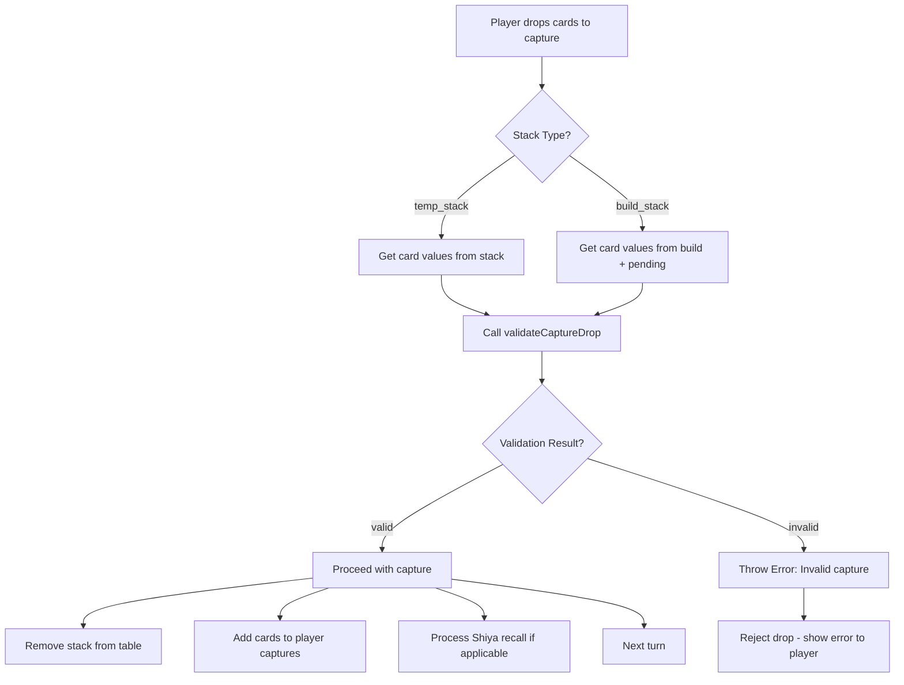

# Capture Drop Validation Upgrade

## Problem Statement

Currently, [`dropToCapture.js`](shared/game/actions/dropToCapture.js) skips all validations when a player drops cards to capture (see lines 94 and 164). This allows invalid captures to go through, such as:

- `[5,2,4,4,7]` for build target 7 - **INVALID** because 4+4 = 8, not 7

## Requirements

### Valid Capture Patterns

The capture array must follow these rules:

1. **Last card is REQUIRED to be the capture signal** - it must equal the target value
2. **All preceding cards must form valid sum groups** that equal the target
3. Each group of consecutive cards must sum exactly to the target value

### Valid Examples (target = 8)

| Array | Validation |
|-------|------------|
| `[6,2,8]` | 6+2=8 ✓, last is 8 ✓ |
| `[8,6,2,8]` | 8 (single), 6+2=8 ✓, last is 8 ✓ |
| `[6,2,8,7,1,8]` | 6+2=8 ✓, 7+1=8 ✓, last is 8 ✓ |
| `[8,8,8]` | 8, 8, last is 8 ✓ |
| `[4,4,8,4,4,8]` | 4+4=8 ✓, 4+4=8 ✓, last is 8 ✓ |

### Invalid Examples

| Array | Target | Issue |
|-------|--------|-------|
| `[5,2,4,4,7]` | 7 | 4+4=8 exceeds 7 ✗ |
| `[6,2,7]` | 8 | 6+2=8 ✓, but last 7 ≠ 8 ✗ |
| `[3,3,8]` | 7 | 3+3=6 ≠ 7 ✗ |
| `[8]` | 8 | Need at least 2 cards ✗ |

## Implementation Plan

### Step 1: Add `validateCaptureDrop` Function

Create a new function in [`dropToCapture.js`](shared/game/actions/dropToCapture.js) that validates the capture array:

```javascript
/**
 * Validates that a capture drop follows correct sum rules.
 * 
 * Rules:
 * 1. Last card MUST equal target (capture signal)
 * 2. All other cards must form groups that sum to target
 * 3. No partial sums can exceed target
 * 
 * @param {Array} cardValues - Array of card values (numbers)
 * @param {number} target - The build target value
 * @returns {Object} - { valid: boolean, reason: string }
 */
function validateCaptureDrop(cardValues, target) {
  // Must have at least 2 cards
  if (!cardValues || cardValues.length < 2) {
    return { valid: false, reason: 'Need at least 2 cards to capture' };
  }

  // Last card must equal target (capture signal)
  const lastCard = cardValues[cardValues.length - 1];
  if (lastCard !== target) {
    return { valid: false, reason: `Last card (${lastCard}) must equal target (${target})` };
  }

  // Process all cards except the last one
  let currentSum = 0;
  for (let i = 0; i < cardValues.length - 1; i++) {
    currentSum += cardValues[i];
    
    // If we exceed target, invalid
    if (currentSum > target) {
      return { valid: false, reason: `Sum ${currentSum} exceeds target ${target}` };
    }
    
    // If we hit exactly target, reset (valid capture group complete)
    if (currentSum === target) {
      currentSum = 0;
    }
  }

  // At the end, currentSum must be 0 (all groups completed)
  // OR must equal target (if last non-capture card hasn't been "closed")
  if (currentSum !== 0 && currentSum !== target) {
    return { valid: false, reason: `Incomplete capture group: sum is ${currentSum}` };
  }

  return { valid: true, reason: 'Valid capture' };
}
```

### Step 2: Integrate Validation into dropToCapture

#### 2.1 Temp Stack Validation (around line 94)

```javascript
// Before: Skip all validations - just accept the drop
// After:
const cardValues = stack.cards.map(c => c.value);
const validation = validateCaptureDrop(cardValues, stack.value);
if (!validation.valid) {
  throw new Error(`Invalid capture: ${validation.reason}`);
}
```

#### 2.2 Build Stack Validation (around line 164)

```javascript
// Before: Skip validation - allow all drops to capture
// After:
const cardValues = buildCards.map(c => c.value);
const validation = validateCaptureDrop(cardValues, stack.value);
if (!validation.valid) {
  throw new Error(`Invalid capture: ${validation.reason}`);
}
```

### Step 3: Add Logging for Debugging

Add console logs to help debug validation failures:

```javascript
console.log(`[dropToCapture] Validating capture:`, { cardValues, target: stack.value, validation });
```

## Testing Scenarios

### Valid Captures
- `[6,2,8]` → valid
- `[8,6,2,8]` → valid  
- `[6,2,8,7,1,8]` → valid
- `[8,8,8,8]` → valid

### Invalid Captures
- `[5,2,4,4,7]` → invalid (4+4=8 > 7)
- `[6,2,7]` → invalid (last 7 ≠ 8)
- `[3,3,8]` → invalid (3+3=6 ≠ 8)
- `[8]` → invalid (need 2+ cards)

## Files to Modify

1. [`shared/game/actions/dropToCapture.js`](shared/game/actions/dropToCapture.js)
   - Add `validateCaptureDrop` function
   - Add validation calls in temp_stack handling
   - Add validation calls in build_stack handling

## Mermaid Flow Diagram


