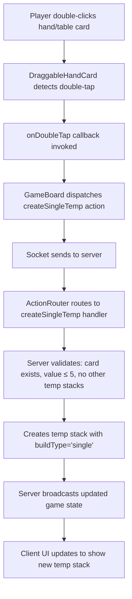

# createSingleTemp Implementation Plan

## Overview
Implement a new action `createSingleTemp` that allows players to create a temporary stack from a single loose card (hand or table) with value ≤ 5. The resulting stack behaves like a normal temp stack (can be extended, captured, etc.).

## Architecture



## Implementation Steps

### 1. Server Handler (shared/game/actions/createSingleTemp.js)
Create new handler file following `createTemp.js` patterns:
- **Input validation**: card with rank, suit, value; source ('hand' or 'table')
- **Guardrail 1**: Only allow cards with value ≤ 5
- **Guardrail 2**: Prevent when another temp stack exists (use `hasAnyActiveTempStack`)
- **Logic**: 
  - Remove card from source (hand or table)
  - Create temp stack with single card, value = card.value, buildType = 'single'
  - Insert at original position (if from table) or end
  - Call `startPlayerTurn` and `triggerAction` (turn does NOT end)

### 2. Register Handler (shared/game/actions/index.js)
Add to action handlers object:
```javascript
createSingleTemp: require('./createSingleTemp'),
```

### 3. Client Action Hook (hooks/game/useGameActions.ts)
Add new action dispatcher:
```typescript
const createSingleTemp = useCallback((card: any, source: 'hand' | 'table' = 'hand') => {
  sendAction({ 
    type: 'createSingleTemp', 
    payload: { card, source } as unknown as Record<string, unknown> 
  });
}, [sendAction]);
```

### 4. Card Component (components/cards/DraggableHandCard.tsx)
Add double-tap gesture detection:
- Import `Gesture` from react-native-gesture-handler
- Add `onDoubleTap?: (card: Card) => void` prop
- Add `Gesture.Tap().numberOfTaps(2)` to detect double-tap
- Call `runOnJS(onDoubleTap)(card)` when double-tap detected

### 5. Hand Area Component (components/game/PlayerHandArea.tsx)
- Add `onDoubleTapCard?: (card: Card) => void` prop
- Pass to each `DraggableHandCard` component

### 6. Game Board Component (components/game/GameBoard.tsx)
- Add handler that:
  - Checks if card value ≤ 5
  - Checks if no active temp stack exists (optional client guardrail)
  - Calls `actions.createSingleTemp(card, source)`

### 7. Update .clinerules
Add section under "Temp Stack Creation":
```markdown
### Single-Card Temp Stack Creation
- Players can create a temp stack from a single loose card (hand or table) by double-clicking the card.
- **Value restriction:** Only cards with value ≤ 5 may be used to start a single-card temp stack.
- The resulting temp stack will have `value = card.value`, `need = 0`, `buildType = 'single'`.
- The stack behaves like any other temp stack (can be extended, captured, etc.).
- The server handler (`createSingleTemp`) enforces the value limit.
```

## File Changes Summary

| File | Change Type | Description |
|------|-------------|-------------|
| `shared/game/actions/createSingleTemp.js` | New | Server handler |
| `shared/game/actions/index.js` | Modify | Register handler |
| `hooks/game/useGameActions.ts` | Modify | Add action dispatcher |
| `components/cards/DraggableHandCard.tsx` | Modify | Add double-tap detection |
| `components/game/PlayerHandArea.tsx` | Modify | Pass double-tap callback |
| `components/game/GameBoard.tsx` | Modify | Dispatch createSingleTemp action |
| `.clinerules` | Modify | Document new feature rules |

## Edge Cases to Handle
1. **Card value > 5**: Server throws descriptive error
2. **Temp stack already exists**: Server throws descriptive error
3. **Card not found at source**: Server throws descriptive error (handles race conditions)
4. **Table card double-tapped**: Allow source='table' for loose table cards only

## UI Behavior
- Single-card temp stack displays with the card and its value badge (e.g., "4")
- Accept/Cancel buttons appear in action strip (same as regular temp stacks)
- Stack can be extended by dropping another card on it
- Stack can be captured by opponents (following existing capture rules)