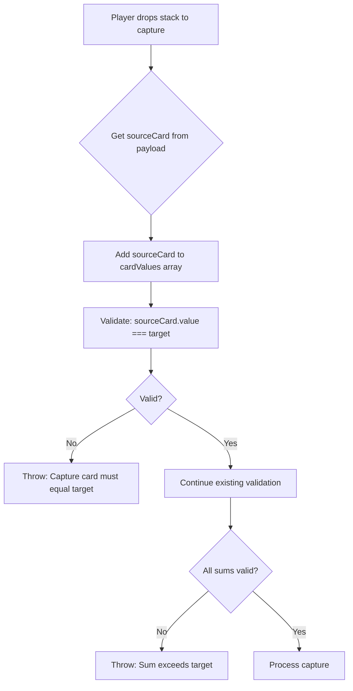

# DropToCapture Source Hand Validation

## Problem

The current validation in `dropToCapture.js` checks that the last card equals the target, but it doesn't verify that this card comes from the player's hand (source hand).

## Requirement

**The capture card (last card in array) must be from source hand.**

When a player drops a stack to capture, they must:
1. Drop their temp stack / build
2. Play a card from their hand that equals the target (the capture card)

### Valid Examples

| Array | Target | Source Hand | Valid? |
|-------|--------|-------------|--------|
| `[6,2]` + play 8 from hand | 8 | 8 | ✓ Valid |
| `[4,4]` + play 8 from hand | 8 | 8 | ✓ Valid |
| `[4,2,6]` + play 6 from hand | 6 | 6 | ✓ Valid |

### Invalid Examples

| Array | Target | Source Hand | Issue |
|-------|--------|-------------|-------|
| `[6,2]` + play 5 from hand | 8 | 5 | ✗ Played card ≠ target |
| `[4,4]` (no card from hand) | 8 | none | ✗ No capture card from hand |

## Implementation

### 1. Update validateCaptureDrop Function

Add parameter to receive the source hand card:

```javascript
function validateCaptureDrop(cardValues, target, sourceCard) {
  // ... existing validation ...
  
  // Check if sourceCard equals target (capture card must be from hand)
  if (!sourceCard || sourceCard.value !== target) {
    return { valid: false, reason: `Capture card from hand must equal target (${target})` };
  }
  
  // ... rest of validation ...
}
```

### 2. Update dropToCapture to Pass Source Card

The payload should contain the source card:

```javascript
// In dropToCapture:
const { stackId, stackType, source, sourceCard } = payload;

// For temp_stack:
const cardValues = [...stack.cards.map(c => c.value), sourceCard.value];

// For build_stack:
const cardValues = [...buildCards.map(c => c.value), sourceCard.value];
```

### 3. Update Validation Calls

```javascript
// Temp stack validation
const cardValues = [...stack.cards.map(c => c.value), sourceCard.value];
const validation = validateCaptureDrop(cardValues, stack.value, sourceCard);

// Build stack validation
const cardValues = [...buildCards.map(c => c.value), sourceCard.value];
const validation = validateCaptureDrop(cardValues, stack.value, sourceCard);
```

## Files to Modify

1. `shared/game/actions/dropToCapture.js`
   - Update `validateCaptureDrop` to accept and validate source card
   - Update temp_stack handling to include sourceCard
   - Update build_stack handling to include sourceCard

## Mermaid Flow


