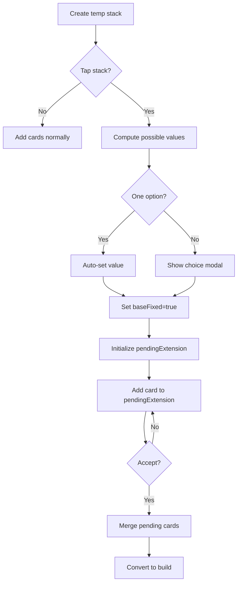

# Dual Builds with Tap-to-Fix Workflow Plan

## Overview
Implement a feature allowing players to create "dual builds" by tapping a temp stack to fix its target value, then add cards to extend it like a build. This works in both 2-player and 4-player modes.

## Changes Required

### 1. Update TempStack Type
**File:** `components/table/types.ts`

Add two new optional fields to TempStack:
```typescript
export interface TempStack {
  // ... existing fields
  baseFixed?: boolean;           // When true, value is fixed (like a build)
  pendingExtension?: {           // Cards pending to be added (like build_stack)
    cards: Array<{ card: Card; source: string }>;
  };
}
```

### 2. Update TempStackView Display
**File:** `components/table/TempStackView.tsx`

**Changes:**
- Add `onBuildTap` prop (optional callback when stack is tapped)
- Add `TouchableOpacity` tap area covering the stack
- Update display logic:
  - When `baseFixed` is true:
    - Show deficit/excess (`-X` or `+X`) relative to fixed `value`
    - Use red badge color for incomplete, team color for complete
  - When `baseFixed` is false: use existing hint-based calculation

**Display Logic:**
```
if (baseFixed && pendingExtension):
  effectiveSum = sum of pending cards (with reset on exact match)
  if effectiveSum === 0: show value
  if effectiveSum < value: show -X
  if effectiveSum > value: show +X
```

### 3. Create setTempBuildValue Action
**File:** `shared/game/actions/setTempBuildValue.js`

**Purpose:** Sets the fixed target value when player taps a temp stack

**Logic:**
```javascript
function setTempBuildValue(state, payload, playerIndex) {
  // payload: { stackId, chosenValue }
  // 1. Find temp stack
  // 2. Validate player owns stack
  // 3. Set stack.value = chosenValue
  // 4. Set stack.baseFixed = true
  // 5. Initialize stack.pendingExtension = { cards: [] }
}
```

### 4. Update addToTemp Action
**File:** `shared/game/actions/addToTemp.js`

**Changes:**
- When `baseFixed` is true:
  - Validate card rank <= stack.value (like build extension)
  - Add card to `pendingExtension.cards` instead of main `cards` array
- When `baseFixed` is false (existing behavior):
  - Keep current logic (recalculate value based on sum)

### 5. Update acceptTemp Action
**File:** `shared/game/actions/acceptTemp.js`

**Changes:**
- When accepting a temp stack with `baseFixed = true`:
  - Merge `pendingExtension.cards` into main `cards` array
  - Clear `pendingExtension`
  - Convert to `build_stack` with the fixed value

### 6. Add Action to Index
**File:** `shared/game/actions/index.js`

Add the new action:
```javascript
setTempBuildValue: require('./setTempBuildValue'),
```

### 7. Add onBuildTap Handler in Parent
**File:** `components/table/TableArea.tsx` (or wherever TempStackItem is used)

**Changes:**
- Pass `onBuildTap` prop to TempStackItem/TempStackView
- Handler uses `getPossibleBuildValues` to compute possible values
- Either auto-set (if only one option) or show choice modal
- Dispatch `setTempBuildValue` action with chosen value

## User Flow

1. **Create temp stack:** Player plays 3♠+2♥ → temp stack has `cards=[3,2]`, `value=5`, `baseFixed=false`

2. **Tap to fix:** Player taps stack → `onBuildTap` computes possible values (5) → dispatches `setTempBuildValue({stackId, chosenValue:5})` → stack now has `value=5`, `baseFixed=true`, `pendingExtension={cards:[]}`

3. **Add cards:** Player adds 4♣ → `addToTemp` validates 4≤5, adds to `pendingExtension` → UI shows `-1`

4. **Add more:** Player adds 1♦ → pending sum = 5 = target → UI shows `5` (complete)

5. **Accept:** Player accepts → `acceptTemp` merges cards, converts to build → final build has cards `[3,2,4,1]` (preserved order), value=5

## Mermaid Diagram



## Testing Checklist
- [ ] Create temp stack with 2 cards
- [ ] Tap to set fixed value
- [ ] Add cards and verify deficit/excess shows correctly
- [ ] Accept and verify cards merged in order
- [ ] Works in both 2-player and 4-player modes
