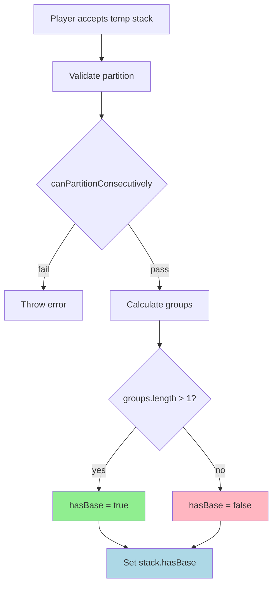

# Dynamic hasBase from Partition Plan

## Overview
Replace the `hasBase` flag logic that currently depends on `buildType` with dynamic derivation from actual card partition groups.

## Current State

### Lines that set `hasBase` from `buildType`:

1. **[`shared/game/actions/acceptTemp.js`](shared/game/actions/acceptTemp.js:100)** (line 100):
   ```javascript
   stack.hasBase = (stack.buildType === 'diff');
   ```

2. **[`shared/game/actions/endTurn.js`](shared/game/actions/endTurn.js:28)** (line 28):
   ```javascript
   stackToAccept.hasBase = (stackToAccept.buildType === 'diff');
   ```

3. **[`shared/game/actions/stealBuild.js`](shared/game/actions/stealBuild.js)** - 4 locations:
   - Line 111: `buildStack.hasBase = (buildStack.buildType !== 'sum');`
   - Line 318: `buildStack.hasBase = (buildStack.buildType !== 'sum');`
   - Line 379: `buildStack.hasBase = (buildStack.buildType !== 'sum');`
   - Line 402: `buildStack.hasBase = (buildStack.buildType !== 'sum');`

## Implementation Plan

### Step 1: Add `getConsecutivePartition` to [`buildCalculator.js`](shared/game/buildCalculator.js)

Add a new function that returns the actual partition groups:

```javascript
/**
 * Returns the consecutive partition groups for values that sum to target.
 * Each group is an array of values that sum to target.
 * 
 * @param {number[]} values - Array of card values
 * @param {number} target - Target sum for each group
 * @returns {number[][]} Array of groups, each group sums to target
 */
function getConsecutivePartition(values, target) {
  const groups = [];
  let sum = 0;
  let currentGroup = [];
  
  for (let i = 0; i < values.length; i++) {
    const v = values[i];
    sum += v;
    currentGroup.push(v);
    
    if (sum === target) {
      groups.push([...currentGroup]);
      sum = 0;
      currentGroup = [];
    } else if (sum > target) {
      return []; // Invalid partition
    }
  }
  
  // If all cards consumed, return the groups
  return sum === 0 ? groups : [];
}
```

Export the new function alongside `canPartitionConsecutively`.

### Step 2: Modify [`acceptTemp.js`](shared/game/actions/acceptTemp.js)

**Changes:**
1. Import `getConsecutivePartition` from `../buildCalculator`
2. After validation (line 41), compute partition groups
3. Set `hasBase = groups.length > 1` instead of using `buildType`

**Modified flow:**
```javascript
// After canPartitionConsecutively validation (existing line 38-41)
const stackValues = stack.cards.map(c => c.value);
if (!canPartitionConsecutively(stackValues, finalValue)) {
  throw new Error(`Cannot build ${finalValue} - cards must be in non-increasing order within each group`);
}

// NEW: Compute partition groups for hasBase determination
const groups = getConsecutivePartition(stackValues, finalValue);
const hasBase = groups.length > 1;

// Remove old line that sets hasBase from buildType
// stack.hasBase = (stack.buildType === 'diff');  // DELETE THIS LINE

// Use the dynamically derived hasBase
stack.hasBase = hasBase;
```

### Step 3: Modify [`endTurn.js`](shared/game/actions/endTurn.js)

**Changes:**
1. Import `getConsecutivePartition` from `../buildCalculator`
2. After setting stack type (line 26-27), compute partition
3. Set `hasBase = groups.length > 1`

```javascript
// After line 27 - stackToAccept.type = 'build_stack';
const stackValues = stackToAccept.cards.map(c => c.value);
const buildValue = stackToAccept.value;
const groups = getConsecutivePartition(stackValues, buildValue);
stackToAccept.hasBase = groups.length > 1;
```

### Step 4: Modify [`stealBuild.js`](shared/game/actions/stealBuild.js)

**Changes:**
1. Import `getConsecutivePartition` from `../buildCalculator`
2. At each location where `hasBase` is set, compute partition groups first
3. Note: `stealBuild` uses `recalcBuild(buildStack)` which already calculates `buildStack.value`

**Locations to update:**
- Line 111: After first `recalcBuild(buildStack)` call
- Line 318: In party mode no-match branch
- Line 379: In else branch (duel/three-hands/four-hands mode)
- Line 402: In final else branch

For each location, the pattern is:
```javascript
const cardValues = buildStack.cards.map(c => c.value);
const groups = getConsecutivePartition(cardValues, buildStack.value);
buildStack.hasBase = groups.length > 1;
```

## Mermaid Diagram - Current vs New Flow



## Key Differences

| Aspect | Old Logic | New Logic |
|--------|----------|----------|
| Source | `buildType` property | Actual card partition |
| Definition | `=== 'diff'` or `!== 'sum'` | `groups.length > 1` |
| Reliability | May be stale/wrong | Always matches actual cards |

## Files to Modify

1. [`shared/game/buildCalculator.js`](shared/game/buildCalculator.js) - Add `getConsecutivePartition`
2. [`shared/game/actions/acceptTemp.js`](shared/game/actions/acceptTemp.js) - Use dynamic partition
3. [`shared/game/actions/endTurn.js`](shared/game/actions/endTurn.js) - Use dynamic partition
4. [`shared/game/actions/stealBuild.js`](shared/game/actions/stealBuild.js) - Use dynamic partition (4 locations)

## Testing Considerations

- Single-card builds (e.g., `[8]` with target `8`) → 1 group → `hasBase = false`
- Multi-card single group (e.g., `[6,4]` with target `10`) → 1 group → `hasBase = false`
- Multi-group builds (e.g., `[6,2,5,3]` with target `10`) → 2 groups → `hasBase = true`