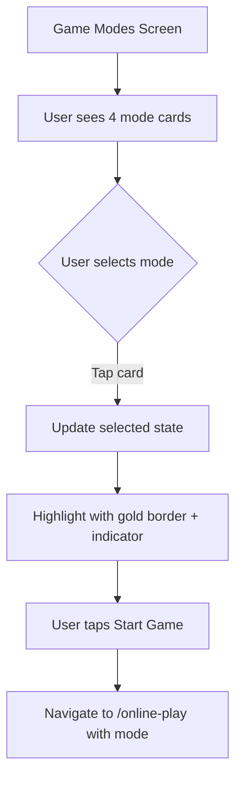

# Game Mode Selection Screen Upgrade Plan

## Overview
Upgrade the game mode selection screen (`app/game-modes.tsx`) to match the new visual design provided in HTML format.

## Visual Analysis of Target Design

### Color Palette
| Element | HTML Color | Current RN Color | Notes |
|---------|------------|------------------|-------|
| Background | `#1a4a1a` | `#0f4d0f` | Slightly darker green |
| Card Background | `#0f3318` | `rgba(0,0,0,0.4)` | Darker green |
| Card Border | `#2a6632` | `#FFD700` | Green border, gold when selected |
| Title | `#f5c842` | `#FFD700` | Gold |
| Mode Name | `#f5c842` | `white` | Gold (not white) |
| Mode Subtitle | `#8fba6a` | `#FFD700` | Light green |
| Badge Background | `#2a5c20` | `rgba(255,215,0,0.15)` | Darker green |
| Badge Text | `#a8d87a` | `#FFD700` | Light green |
| Button | `#f5c842` | N/A | Gold |

### Layout Differences
- Current: Full-width cards with centered content
- Target: Cards with icons on left, text in middle, badge on right
- Target: Selected card has a left yellow border indicator

### Interactive Effects (New)
1. **Card Hover/Press States**:
   - Border color changes to gold (#f5c842)
   - Background lightens (#143d1e)
   - Slight upward translateY(-2px)
   
2. **Selection Indicator**:
   - Left border (4px) in gold for selected state
   - Persists after selection

3. **Ripple Animation** (JavaScript):
   - On click, creates expanding circle effect
   - Uses CSS animation (rippleOut)

4. **Start Button**:
   - Full-width at bottom
   - Gold background with dark text
   - Hover state: brighter gold (#fad84a)

### Icon Style
- Current: Ionicons (simple glyph icons)
- Target: Custom SVG icons with more detail
  - 2 Hands: Two circles with curved paths below (two players)
  - 3 Hands: Three circles with paths (three players)
  - 4 Hands: Rectangular card icon with circle
  - Party: Star/polygon shape

---

## Implementation Steps

### Step 1: Update Color Constants
- Define new color palette matching HTML design
- Use consistent colors across the app

### Step 2: Restructure Card Layout
- Position icon on left (52x52 container)
- Text in middle (flex: 1)
- Badge on right
- Add left border indicator for selected state

### Step 3: Implement State Management for Selection
- Add selected state (currently navigates directly on press)
- Store selected mode in component state
- Add "Start Game" button at bottom

### Step 4: Add Hover/Press Effects (React Native)
- Use `android_ripple` for touch feedback
- Implement scale transform on press
- Add border color animation via conditional styles

### Step 5: Create Custom SVG Icons
- Import or create SVG components for each game mode
- Match the visual style from HTML design

### Step 6: Style the Start Button
- Match gold button styling from HTML
- Add hover/press states

---

## Mermaid: Component Flow

---

## Files to Modify
- `app/game-modes.tsx` - Main screen component
- `constants/theme.ts` - Update color constants if needed

## New Dependencies
- `react-native-svg` - For custom mode icons
