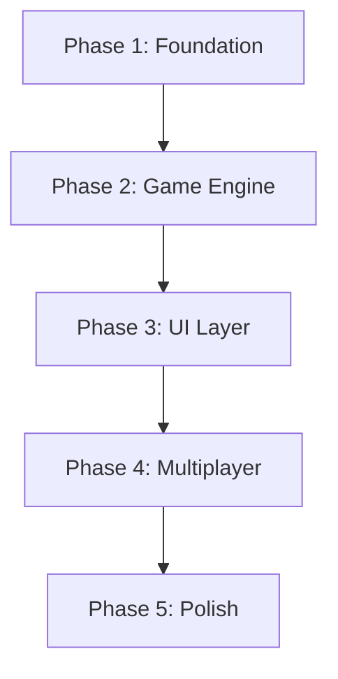
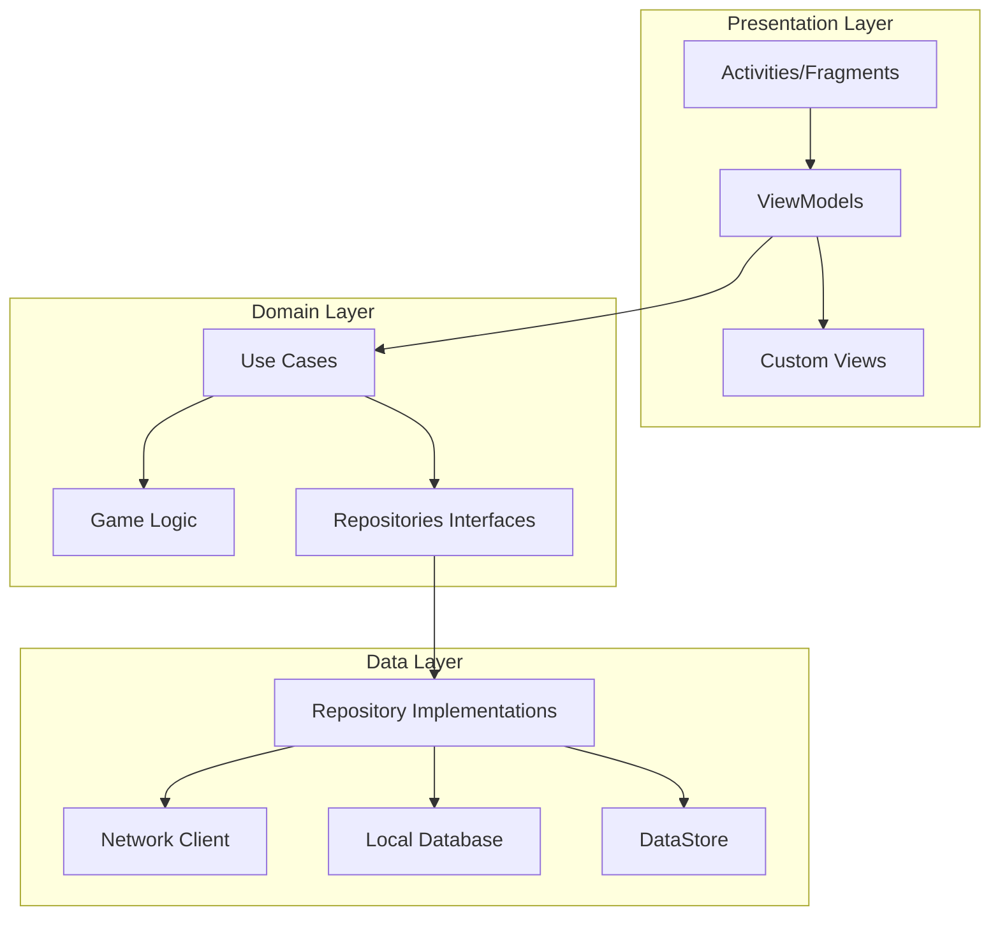

# Kotlin Migration Plan - Casino Game Application

## Executive Summary

This document outlines a comprehensive migration strategy to transform the current Expo/React Native casino game application into a pure Kotlin Android application. The migration addresses the user's four primary motivations:

1. **Better performance for game animations** - Native Kotlin offers superior animation performance through direct Android API access
2. **Better App Store presence/visibility** - Native apps receive better algorithmic visibility and user trust
3. **Full native Android capabilities** - Access to all Android APIs without Expo constraints
4. **Fix current Android runtime issues** - Resolve Metro bundler dependency and APK runtime errors

---

## 1. Scope and Complexity Assessment

### 1.1 Current Technology Stack

| Component | Current Technology | Target Technology |
|-----------|---------------------|-------------------|
| Framework | Expo SDK 54 + React Native 0.81.5 | Pure Android (Kotlin) |
| Language | TypeScript ~5.9.2 | Kotlin 1.9.x |
| Navigation | expo-router v6.0.21 | Jetpack Navigation |
| State Management | React hooks + Context | ViewModel + StateFlow |
| Multiplayer | Socket.io-client | OkHttp + WebSocket |
| Animations | react-native-reanimated | Android Animator APIs |
| Gestures | react-native-gesture-handler | Android GestureDetector |
| Storage | AsyncStorage | Room + DataStore |
| Networking | Expo modules | OkHttp + Retrofit |

### 1.2 Codebase Scope Analysis

#### Game Logic Files (Shared)
```
shared/game/
├── constants.js           # Card constants (ranks, suits)
├── deck.js               # Deck creation and shuffling
├── GameState.js          # State management
├── initialization.js    # Game setup (2/3/4 player modes)
├── turn.js               # Turn management
├── round.js              # Round progression
├── scoring.js            # Score calculation
├── buildCalculator.js    # Build value calculations
├── team.js               # Team management
├── validation.js         # Game validation
├── clone.js              # State cloning
├── stackId.js            # Stack ID generation
├── ActionRouter.js       # Action routing
└── actions/              # 30+ action handlers
    ├── trail.js
    ├── createTemp.js
    ├── capture.js
    ├── addToBuild.js
    ├── stealBuild.js
    ├── extendBuild.js
    ├── recall.js
    ├── tournament actions
    └── ... (24 more)
```

#### Smart Router System
```
shared/game/smart-router/
├── Router.js              # Main routing logic
├── handlers/              # Card placement handlers
│   ├── FriendlyBuildHandler.js
│   ├── OpponentBuildHandler.js
│   └── TempStackDropHandler.js
├── routers/               # Target-specific routers
│   ├── CaptureRouter.js
│   ├── TrailRouter.js
│   ├── LooseCardRouter.js
│   └── ExtendRouter.js
└── validators/            # Validation logic
    ├── CardSourceValidator.js
    └── StealValidator.js
```

#### UI Components
- **Table Components**: Card rendering, drag-and-drop, stack displays
- **Modals**: Game over, play options, tournament, capture confirmation
- **Tournament**: Status bar, spectator view, qualification review
- **Tutorial**: Tutorial viewer with game board simulation

#### Multiplayer Architecture
```
multiplayer/server/
├── socket-server.js        # Main Socket.io server
├── game/
│   ├── GameManager.js      # Game instance management
│   ├── ActionRouter.js     # Server-side action routing
│   └── utils/              # Validation and utilities
├── services/
│   ├── GameCoordinatorService.js
│   ├── RoomService.js
│   ├── TournamentManager.js
│   ├── BroadcasterService.js
│   └── UnifiedMatchmakingService.js
├── routes/                 # REST API endpoints
└── models/                 # MongoDB models
```

### 1.3 Complexity Assessment

| Category | Complexity | Notes |
|----------|------------|-------|
| Game Logic | **HIGH** | 30+ action types, complex state mutations |
| Card Game Rules | **HIGH** | Multi-card builds, temp stacks, steals, recalls |
| Tournament System | **HIGH** | Knockout brackets, qualification rounds |
| Multiplayer | **HIGH** | Real-time sync, room management, matchmaking |
| Animations | **MEDIUM** | Card movements, deal animations, captures |
| Gestures | **MEDIUM** | Drag-and-drop, tap detection |
| State Management | **HIGH** | Complex state transitions, undo scenarios |

---

## 2. File-by-File Migration Strategy

### 2.1 Migration Order



### 2.2 Phase 1: Foundation (Weeks 1-3)

#### Project Setup
| File/Component | Migration Target | Priority |
|----------------|------------------|----------|
| `package.json` dependencies | `build.gradle` dependencies | P0 |
| `app.json` configuration | `AndroidManifest.xml` | P0 |
| `tsconfig.json` | N/A (Kotlin uses strong typing) | P0 |
| Environment variables | `BuildConfig` + `gradle.properties` | P1 |

#### Kotlin Dependencies
```kotlin
// build.gradle (app module)
dependencies {
    // AndroidX Core
    implementation 'androidx.core:core-ktx:1.12.0'
    implementation 'androidx.appcompat:appcompat:1.6.1'
    implementation 'com.google.android.material:material:1.11.0'
    implementation 'androidx.constraintlayout:constraintlayout:2.1.4'
    
    // Navigation
    implementation 'androidx.navigation:navigation-fragment-ktx:2.7.6'
    implementation 'androidx.navigation:navigation-ui-ktx:2.7.6'
    
    // Lifecycle & ViewModel
    implementation 'androidx.lifecycle:lifecycle-viewmodel-ktx:2.7.0'
    implementation 'androidx.lifecycle:lifecycle-livedata-ktx:2.7.0'
    implementation 'androidx.lifecycle:lifecycle-runtime-ktx:2.7.0'
    
    // Coroutines
    implementation 'org.jetbrains.kotlinx:kotlinx-coroutines-android:1.7.3'
    
    // Networking
    implementation 'com.squareup.okhttp3:okhttp:4.12.0'
    implementation 'com.squareup.retrofit2:retrofit:2.9.0'
    implementation 'com.squareup.retrofit2:converter-gson:2.9.0'
    implementation 'com.github.nickagas:websocket:1.0.1'
    
    // Database
    implementation 'androidx.room:room-runtime:2.6.1'
    implementation 'androidx.room:room-ktx:2.6.1'
    implementation 'androidx.datastore:datastore-preferences:1.0.0'
    
    // Image Loading
    implementation 'io.coil-kt:coil:2.5.0'
    
    // Serialization
    implementation 'com.google.code.gson:gson:2.10.1'
}
```

### 2.3 Phase 2: Game Engine Porting (Weeks 3-8)

#### Core Game Logic Migration Map

| JavaScript File | Kotlin File | Action Required |
|-----------------|-------------|-----------------|
| `constants.js` | `CardConstants.kt` | Direct port |
| `deck.js` | `DeckManager.kt` | Direct port |
| `GameState.kt` (from index.js) | `GameState.kt` | Redesign with StateFlow |
| `initialization.js` | `GameInitializer.kt` | Direct port |
| `turn.js` | `TurnManager.kt` | Direct port |
| `round.js` | `RoundManager.kt` | Direct port |
| `scoring.js` | `ScoreCalculator.kt` | Direct port |
| `buildCalculator.js` | `BuildCalculator.kt` | Direct port |
| `team.js` | `TeamManager.kt` | Direct port |
| `validation.js` | `GameValidator.kt` | Direct port |
| `clone.js` | `StateCopier.kt` | Replace with Kotlin data class copying |

#### Action Handlers Migration

| JS Action File | Kotlin Handler | Priority |
|----------------|----------------|----------|
| `trail.js` | `TrailHandler.kt` | P0 |
| `createTemp.js` | `CreateTempHandler.kt` | P0 |
| `addToTemp.js` | `AddToTempHandler.kt` | P0 |
| `capture.js` | `CaptureHandler.kt` | P0 |
| `captureOwn.js` | `CaptureOwnHandler.kt` | P0 |
| `captureOpponent.js` | `CaptureOpponentHandler.kt` | P0 |
| `addToBuild.js` | `AddToBuildHandler.kt` | P0 |
| `stealBuild.js` | `StealBuildHandler.kt` | P0 |
| `extendBuild.js` | `ExtendBuildHandler.kt` | P0 |
| `recall.js` | `RecallHandler.kt` | P1 |
| Tournament actions | TournamentHandlers | P1 |

#### Smart Router Porting

| JS Router | Kotlin Router | Priority |
|-----------|---------------|----------|
| `Router.js` | `SmartRouter.kt` | P0 |
| `CaptureRouter.js` | `CaptureRouter.kt` | P0 |
| `TrailRouter.js` | `TrailRouter.kt` | P0 |
| `LooseCardRouter.js` | `LooseCardRouter.kt` | P0 |
| `ExtendRouter.js` | `ExtendRouter.kt` | P0 |
| `TempRouter.js` | `TempRouter.kt` | P0 |

### 2.4 Phase 3: UI Layer Migration (Weeks 8-14)

#### Component Migration Matrix

| React Native Component | Kotlin Android Equivalent | Priority |
|------------------------|--------------------------|----------|
| `TableArea.tsx` | `GameTableView` | P0 |
| `DraggableCard.tsx` | `CardView` + `DragListener` | P0 |
| `CapturePile.tsx` | `CapturePileView` | P0 |
| `TempStackView.tsx` | `TempStackView` | P0 |
| `BuildStackView.tsx` | `BuildStackView` | P0 |
| All Modals | `DialogFragment` | P1 |
| `TournamentStatusBar.tsx` | `TournamentStatusView` | P1 |
| `TurnIndicator.tsx` | `TurnIndicatorView` | P1 |
| `PlayerIcon.tsx` | `PlayerAvatarView` | P1 |

#### Animation Strategy

```kotlin
// Card Animation Example
class CardAnimator(
    private val cardView: CardView,
    private val duration: Long = 300
) {
    fun animateFromHandToTable(
        startX: Float, startY: Float,
        endX: Float, endY: Float,
        rotation: Float = 0f,
        onComplete: () -> Unit = {}
    ) {
        cardView.apply {
            // Position
            animate()
                .x(endX).y(endY)
                .rotation(rotation)
                .setDuration(duration)
                .withEndAction { onComplete() }
                .start()
            
            // Scale effect for depth
            animate()
                .scaleX(0.9f)
                .setDuration(duration / 2)
                .withEndAction {
                    animate()
                        .scaleX(1f)
                        .start()
                }
                .start()
        }
    }
    
    fun animateCapture(targetView: View, onComplete: () -> Unit) {
        val location = IntArray(2)
        targetView.getLocationOnScreen(location)
        
        cardView.animate()
            .x(location[0].toFloat())
            .y(location[1].toFloat())
            .scaleX(0.5f)
            .scaleY(0.5f)
            .alpha(0.8f)
            .setDuration(duration)
            .withEndAction {
                cardView.animate()
                    .alpha(0f)
                    .setDuration(100)
                    .withEndAction { onComplete() }
                    .start()
            }
            .start()
    }
}
```

### 2.5 Phase 4: Multiplayer Integration (Weeks 14-18)

#### Network Layer Porting

| JS Module | Kotlin Module | Protocol |
|-----------|---------------|----------|
| `socket.io-client` | `SocketClient.kt` | WebSocket |
| Server REST API | `GameApiService.kt` | Retrofit |
| Room management | `RoomManager.kt` | Business Logic |
| Matchmaking | `MatchmakingService.kt` | Business Logic |

#### WebSocket Client Implementation

```kotlin
class GameSocketClient(
    private val url: String,
    private val scope: CoroutineScope
) {
    private val client = OkHttpClient()
    private var webSocket: WebSocket? = null
    private val _gameState = MutableStateFlow<GameState?>(null)
    val gameState: StateFlow<GameState?> = _gameState
    
    private val _connectionState = MutableStateFlow(ConnectionState.DISCONNECTED)
    val connectionState: StateFlow<ConnectionState> = _connectionState
    
    fun connect() {
        _connectionState.value = ConnectionState.CONNECTING
        
        val request = Request.Builder()
            .url(url)
            .build()
        
        webSocket = client.newWebSocket(request, SocketListener())
    }
    
    fun joinGame(roomCode: String) {
        sendMessage(GameMessage.JoinRoom(roomCode))
    }
    
    fun sendAction(action: GameAction) {
        sendMessage(GameMessage.Action(action))
    }
    
    private fun sendMessage(message: GameMessage) {
        val json = Gson().toJson(message)
        webSocket?.send(json)
    }
    
    private inner class SocketListener : WebSocketListener() {
        override fun onOpen(webSocket: WebSocket, response: Response) {
            _connectionState.value = ConnectionState.CONNECTED
        }
        
        override fun onMessage(webSocket: WebSocket, text: String) {
            val message = Gson().fromJson(text, ServerMessage::class.java)
            handleServerMessage(message)
        }
        
        override fun onClosing(webSocket: WebSocket, code: Int, reason: String) {
            _connectionState.value = ConnectionState.DISCONNECTING
        }
        
        override fun onClosed(webSocket: WebSocket, code: Int, reason: String) {
            _connectionState.value = ConnectionState.DISCONNECTED
        }
    }
}

enum class ConnectionState {
    DISCONNECTED, CONNECTING, CONNECTED, DISCONNECTING
}
```

---

## 3. Architecture Design for Kotlin Android

### 3.1 Clean Architecture Layers



### 3.2 Package Structure

```
com.casinogame.app/
├── data/
│   ├── local/
│   │   ├── database/
│   │   │   ├── CasinoDatabase.kt
│   │   │   ├── dao/
│   │   │   │   ├── PlayerProfileDao.kt
│   │   │   │   └── GameHistoryDao.kt
│   │   │   └── entity/
│   │   │       ├── PlayerProfileEntity.kt
│   │   │       └── GameHistoryEntity.kt
│   │   └── preferences/
│   │       └── UserPreferences.kt
│   ├── remote/
│   │   ├── api/
│   │   │   ├── GameApiService.kt
│   │   │   └── AuthApiService.kt
│   │   ├── dto/
│   │   │   ├── GameStateDto.kt
│   │   │   └── PlayerDto.kt
│   │   └── socket/
│   │       └── GameSocketClient.kt
│   └── repository/
│       ├── GameRepositoryImpl.kt
│       └── PlayerRepositoryImpl.kt
├── domain/
│   ├── model/
│   │   ├── Card.kt
│   │   ├── Player.kt
│   │   ├── GameState.kt
│   │   ├── GameMode.kt
│   │   └── Tournament.kt
│   ├── usecase/
│   │   ├── game/
│   │   │   ├── ExecuteGameActionUseCase.kt
│   │   │   ├── StartGameUseCase.kt
│   │   │   └── CalculateScoreUseCase.kt
│   │   └── player/
│   │       ├── SavePlayerProfileUseCase.kt
│   │       └── GetPlayerStatsUseCase.kt
│   └── repository/
│       ├── GameRepository.kt
│       └── PlayerRepository.kt
├── game/
│   ├── engine/
│   │   ├── GameEngine.kt
│   │   ├── TurnManager.kt
│   │   ├── RoundManager.kt
│   │   └── ScoreCalculator.kt
│   ├── actions/
│   │   ├── ActionHandler.kt
│   │   ├── TrailHandler.kt
│   │   ├── CaptureHandler.kt
│   │   ├── BuildHandler.kt
│   │   └── TempStackHandler.kt
│   └── smartrouter/
│       ├── SmartRouter.kt
│       ├── CaptureRouter.kt
│       ├── TrailRouter.kt
│       └── BuildValidator.kt
├── presentation/
│   ├── main/
│   │   ├── MainActivity.kt
│   │   └── MainViewModel.kt
│   ├── game/
│   │   ├── GameFragment.kt
│   │   ├── GameViewModel.kt
│   │   └── view/
│   │       ├── GameTableView.kt
│   │       ├── CardView.kt
│   │       ├── CapturePileView.kt
│   │       └── HandView.kt
│   ├── menu/
│   │   ├── MenuFragment.kt
│   │   └── MenuViewModel.kt
│   ├── lobby/
│   │   ├── LobbyFragment.kt
│   │   └── LobbyViewModel.kt
│   └── tournament/
│       ├── TournamentFragment.kt
│       └── TournamentViewModel.kt
├── ui/
│   ├── animation/
│   │   ├── CardAnimator.kt
│   │   └── DealAnimator.kt
│   ├── gesture/
│   │   └── CardDragGestureDetector.kt
│   └── theme/
│       ├── Colors.kt
│       ├── Typography.kt
│       └── Dimensions.kt
└── util/
    ├── Extensions.kt
    ├── Logger.kt
    └── Constants.kt
```

### 3.3 State Management

```kotlin
// Game State with StateFlow
class GameViewModel(
    private val executeGameAction: ExecuteGameActionUseCase,
    private val gameRepository: GameRepository
) : ViewModel() {
    
    private val _gameState = MutableStateFlow<GameState?>(null)
    val gameState: StateFlow<GameState?> = _gameState.asStateFlow()
    
    private val _currentPlayer = MutableStateFlow<Player?>(null)
    val currentPlayer: StateFlow<Player?> = _currentPlayer.asStateFlow()
    
    private val _gamePhase = MutableStateFlow(GamePhase.WAITING)
    val gamePhase: StateFlow<GamePhase> = _gamePhase.asStateFlow()
    
    private val _uiState = MutableStateFlow<GameUiState>(GameUiState.Idle)
    val uiState: StateFlow<GameUiState> = _uiState.asStateFlow()
    
    private val _connectionState = MutableStateFlow(ConnectionState.DISCONNECTED)
    val connectionState: StateFlow<ConnectionState> = _connectionState.asStateFlow()
    
    fun executeAction(action: GameAction) {
        viewModelScope.launch {
            try {
                _uiState.value = GameUiState.Processing
                
                val result = executeGameAction(
                    currentState = _gameState.value!!,
                    action = action,
                    playerIndex = _currentPlayer.value!!.index
                )
                
                _gameState.value = result.newState
                
                // Handle turn progression
                if (result.turnEnded) {
                    advanceTurn(result.newState)
                }
                
                _uiState.value = GameUiState.Idle
            } catch (e: GameException) {
                _uiState.value = GameUiState.Error(e.message)
            }
        }
    }
    
    private fun advanceTurn(state: GameState) {
        val nextPlayer = state.turnManager.getNextPlayer()
        _currentPlayer.value = state.players[nextPlayer]
        
        if (state.turnManager.allPlayersFinished()) {
            _gamePhase.value = GamePhase.ROUND_END
            handleRoundEnd(state)
        }
    }
}

sealed class GameUiState {
    object Idle : GameUiState()
    object Processing : GameUiState()
    data class Error(val message: String) : GameUiState()
    data class Modal(val modalType: ModalType) : GameUiState()
}
```

---

## 4. Game Engine Porting Approach

### 4.1 Data Model Translation

#### JavaScript Card Model
```javascript
// shared/game/deck.js
{ suit: '♠', rank: 'A', value: 14 }
```

#### Kotlin Data Class
```kotlin
data class Card(
    val suit: Suit,
    val rank: Rank,
    val value: Int
) {
    val displayString: String
        get() = "${rank.symbol}${suit.symbol}"
    
    val isAce: Boolean get() = rank == Rank.ACE
    val isTen: Boolean get() = rank == Rank.TEN
    val isTwoSpades: Boolean get() = suit == Suit.SPADES && rank == Rank.TWO
    val isTenDiamonds: Boolean get() = suit == Suit.DIAMONDS && rank == Rank.TEN
}

enum class Suit(val symbol: String) {
    SPADES("♠"),
    HEARTS("♥"),
    DIAMONDS("♦"),
    CLUBS("♣")
}

enum class Rank(val symbol: String, val value: Int) {
    TWO("2", 2), THREE("3", 3), FOUR("4", 4), FIVE("5", 5),
    SIX("6", 6), SEVEN("7", 7), EIGHT("8", 8), NINE("9", 9),
    TEN("10", 10), JACK("J", 11), QUEEN("Q", 12), KING("K", 13), ACE("A", 14)
}
```

### 4.2 State Mutation Pattern

#### JavaScript (Mutates in place)
```javascript
function trail(state, playerIndex, card) {
    state.players[playerIndex].hand = state.players[playerIndex].hand
        .filter(c => c !== card);
    state.tableCards.push(card);
    // ... more mutations
    return state;
}
```

#### Kotlin (Immutable with copy)
```kotlin
fun trail(state: GameState, playerIndex: Int, card: Card): GameState {
    val player = state.players[playerIndex]
    val updatedHand = player.hand - card
    
    val updatedPlayer = player.copy(hand = updatedHand)
    val updatedPlayers = state.players.toMutableList().apply {
        this[playerIndex] = updatedPlayer
    }
    
    val updatedTableCards = state.tableCards + card
    
    return state.copy(
        players = updatedPlayers,
        tableCards = updatedTableCards,
        lastAction = GameAction.Trail(playerIndex, card)
    )
}
```

### 4.3 Build Calculator Porting

```kotlin
// Core build calculation algorithm
object BuildCalculator {
    
    fun calculateBuildValue(cards: List<Card>): BuildResult {
        if (cards.isEmpty()) {
            return BuildResult(0, 0, BuildType.NONE)
        }
        
        if (cards.size == 1) {
            return BuildResult(cards[0].value, 0, BuildType.SINGLE)
        }
        
        // Try multi-build partition first
        val multiBuild = calculateMultiBuildValue(cards.map { it.value })
        if (multiBuild != null) return multiBuild
        
        // Fall back to simple 2-card logic
        val total = cards.sumOf { it.value }
        
        if (total <= 10) {
            return BuildResult(total, 0, BuildType.SUM)
        }
        
        // Difference build
        val sorted = cards.sortedByDescending { it.value }
        val base = sorted.first().value
        val otherSum = sorted.drop(1).sumOf { it.value }
        val need = base - otherSum
        
        return BuildResult(
            value = base,
            need = maxOf(need, 0),
            buildType = BuildType.DIFF
        )
    }
    
    private fun calculateMultiBuildValue(values: List<Int>): BuildResult? {
        if (values.size < 2) return null
        
        val total = values.sum()
        if (total <= 10) {
            return BuildResult(total, 0, BuildType.SUM)
        }
        
        // Try all possible partitions
        val maxMask = 1 shl values.size
        
        for (mask in 1 until maxMask) {
            val subset1 = mutableListOf<Int>()
            val subset2 = mutableListOf<Int>()
            
            values.forEachIndexed { index, value ->
                if (mask and (1 shl index) != 0) {
                    subset1.add(value)
                } else {
                    subset2.add(value)
                }
            }
            
            val target1 = getBuildTargetForSubset(subset1)
            val target2 = getBuildTargetForSubset(subset2)
            
            if (target1 != null && target2 != null && target1 == target2) {
                return BuildResult(target1, 0, BuildType.MULTI)
            }
        }
        
        return null
    }
    
    private fun getBuildTargetForSubset(values: List<Int>): Int? {
        if (values.isEmpty()) return null
        
        val total = values.sum()
        
        return if (total <= 10) {
            total
        } else {
            val max = values.maxOrNull() ?: return null
            val otherSum = total - max
            if (max - otherSum >= 0) max else null
        }
    }
}

data class BuildResult(
    val value: Int,
    val need: Int,
    val buildType: BuildType
)

enum class BuildType {
    NONE, SINGLE, SUM, DIFF, MULTI
}
```

### 4.4 Smart Router Implementation

```kotlin
class SmartRouter(
    private val gameState: GameState,
    private val playerIndex: Int
) {
    
    fun determineAction(
        sourceCard: Card,
        sourceLocation: CardLocation,
        targetLocation: CardLocation?
    ): GameAction? {
        
        return when {
            // Trail: play card to empty table
            targetLocation == null && gameState.tableCards.isEmpty() -> {
                GameAction.Trail(playerIndex, sourceCard)
            }
            
            // Trail: card >= highest table card
            targetLocation == null && canTrail(sourceCard) -> {
                GameAction.Trail(playerIndex, sourceCard)
            }
            
            // Capture: target is capture pile
            targetLocation is CardLocation.CapturePile -> {
                handleCapture(sourceCard, sourceLocation, targetLocation)
            }
            
            // Build: target is existing build/temp
            targetLocation is CardLocation.BuildSlot -> {
                handleBuild(sourceCard, sourceLocation, targetLocation)
            }
            
            else -> null
        }
    }
    
    private fun canTrail(card: Card): Boolean {
        val highestTableCard = gameState.tableCards.maxByOrNull { it.value }
            ?: return true
        return card.value >= highestTableCard.value
    }
    
    private fun handleCapture(
        card: Card,
        source: CardLocation,
        target: CardLocation.CapturePile
    ): GameAction? {
        return when (source) {
            is CardLocation.Hand -> {
                if (canCaptureCard(card, target.capturedCards)) {
                    GameAction.Capture(playerIndex, card, target.pileIndex)
                } else null
            }
            else -> null
        }
    }
    
    private fun canCaptureCard(card: Card, capturedCards: List<Card>): Boolean {
        val buildResult = BuildCalculator.calculateBuildValue(capturedCards.map { it.value })
        return card.value == buildResult.value || card.value == buildResult.need
    }
}
```

---

## 5. Timeline and Phases

### 5.1 Migration Timeline Overview

| Phase | Duration | Focus | Deliverable |
|-------|----------|-------|-------------|
| Phase 1 | Weeks 1-3 | Foundation & Setup | Empty Android shell project with dependencies |
| Phase 2 | Weeks 3-8 | Core Game Engine | Game logic in Kotlin (local play) |
| Phase 3 | Weeks 8-14 | UI Layer | Playable game with animations |
| Phase 4 | Weeks 14-18 | Multiplayer | Online play functionality |
| Phase 5 | Weeks 18-20 | Polish & Testing | Bug fixes, optimization, release build |

### 5.2 Detailed Phase Breakdown

#### Phase 1: Foundation (Weeks 1-3)
| Week | Tasks | Deliverables |
|------|-------|--------------|
| 1 | Create Android project structure, setup Gradle, verify build | Empty shell compiles |
| 2 | Add dependencies (Coroutines, Navigation, Room, Networking) | Dependencies resolved |
| 3 | Implement basic app shell (Activity, Navigation) | App launches with navigation |

#### Phase 2: Game Engine (Weeks 3-8)
| Week | Tasks | Deliverables |
|------|-------|--------------|
| 3-4 | Port data models (Card, Player, GameState) | Models compile |
| 4-5 | Port core game logic (initialization, turns, scoring) | Local game playable |
| 5-6 | Port action handlers (trail, capture, build) | All actions work |
| 6-7 | Port smart router and validators | Smart card placement works |
| 7-8 | Port tournament system | Tournament mode playable |

#### Phase 3: UI Layer (Weeks 8-14)
| Week | Tasks | Deliverables |
|------|-------|--------------|
| 8-9 | Implement card rendering, table view | Cards display correctly |
| 10 | Implement drag-and-drop, gestures | Cards can be dragged |
| 11 | Implement animations (deal, capture, trail) | Animations smooth |
| 12 | Implement modals and dialogs | All UI states work |
| 13-14 | Polish and bug fixes | UI complete |

#### Phase 4: Multiplayer (Weeks 14-18)
| Week | Tasks | Deliverables |
|------|-------|--------------|
| 14-15 | Implement WebSocket client | Can connect to server |
| 15-16 | Implement room management | Can create/join rooms |
| 16-17 | Implement matchmaking | Can find opponents |
| 17-18 | Implement real-time sync | Online play works |

#### Phase 5: Polish (Weeks 18-20)
| Week | Tasks | Deliverables |
|------|-------|--------------|
| 18-19 | Testing, bug fixes | All features work |
| 20 | Performance optimization, release build | Production APK |

### 5.3 Milestone Checklist

```markdown
## Milestone 1: Foundation Complete (Week 3)
- [ ] Android project compiles
- [ ] Dependencies resolved
- [ ] Navigation working

## Milestone 2: Game Engine Complete (Week 8)
- [ ] All game logic ported
- [ ] Local CPU game playable
- [ ] All action handlers implemented

## Milestone 3: UI Complete (Week 14)
- [ ] All screens implemented
- [ ] Animations smooth
- [ ] Gestures work correctly

## Milestone 4: Multiplayer Complete (Week 18)
- [ ] Online play works
- [ ] Matchmaking functional
- [ ] Real-time sync working

## Milestone 5: Release Ready (Week 20)
- [ ] All bugs fixed
- [ ] Performance optimized
- [ ] APK builds successfully
```

---

## 6. Risk Assessment

### 6.1 Technical Risks

| Risk | Probability | Impact | Mitigation |
|------|-------------|--------|------------|
| Game logic porting errors | HIGH | HIGH | Comprehensive unit tests for each ported function |
| Animation performance issues | MEDIUM | MEDIUM | Use Android Animator APIs, profile early |
| WebSocket stability | MEDIUM | HIGH | Implement reconnection logic, heartbeat |
| State sync race conditions | HIGH | HIGH | Use StateFlow, implement conflict resolution |
| Memory leaks in animations | MEDIUM | MEDIUM | Proper cleanup in lifecycle methods |

### 6.2 Project Risks

| Risk | Probability | Impact | Mitigation |
|------|-------------|--------|------------|
| Scope creep | HIGH | MEDIUM | Strict feature freeze after Phase 1 |
| Team availability | MEDIUM | HIGH | Document thoroughly, use pair programming |
| Testing gaps | HIGH | HIGH | Automate testing, CI/CD pipeline |
| Integration issues | MEDIUM | HIGH | Weekly integration builds |

### 6.3 Risk Mitigation Strategies

#### 1. Game Logic Porting
```kotlin
// Test-driven porting approach
class GameLogicTests {
    
    @Test
    fun `trail action removes card from hand`() {
        // Given: Player with 4 cards in hand
        val state = createTestState()
        val player = state.players[0]
        val cardToTrail = player.hand[0]
        
        // When: Trail action executed
        val newState = trail(state, playerIndex = 0, card = cardToTrail)
        
        // Then: Card removed from hand, added to table
        assertTrue(cardToTrail !in newState.players[0].hand)
        assertTrue(cardToTrail in newState.tableCards)
    }
}
```

#### 2. State Synchronization
```kotlin
// Optimistic updates with rollback
class GameRepositoryImpl(
    private val socketClient: GameSocketClient
) : GameRepository {
    
    override suspend fun executeAction(action: GameAction): Result<GameState> {
        // Apply optimistic update locally
        val optimisticState = gameEngine.executeLocally(currentState, action)
        _localState.value = optimisticState
        
        // Send to server
        return try {
            val serverState = socketClient.sendAction(action)
            _localState.value = serverState
            Result.success(serverState)
        } catch (e: Exception) {
            // Rollback on failure
            _localState.value = currentState
            Result.failure(e)
        }
    }
}
```

---

## 7. Alternative Approaches

### 7.1 React Native CLI Mode

Instead of full Kotlin migration, consider React Native CLI:

| Aspect | React Native CLI | Pure Kotlin |
|--------|-----------------|-------------|
| Development Time | 3-4 weeks | 18-20 weeks |
| Performance | Good (native modules) | Best (full native) |
| Code Reuse | High (most JS) | Low (full rewrite) |
| Maintenance | Lower | Higher |

**When to Choose**: If timeline is critical and current issues can be resolved

**Migration Path**:
1. Run `npx expo run:android` to generate android directory
2. Remove Expo dependencies
3. Fix Metro bundler issues (see existing android-refactor-plan.md)
4. Add native modules as needed

### 7.2 Native Modules in Expo

Use Expo with custom native modules for performance-critical features:

```kotlin
// Custom Kotlin module for animations
class CardAnimationModule(reactContext: ReactApplicationContext) : 
    ReactContextBaseJavaModule(reactContext) {
    
    @ReactMethod
    fun animateCard(
        cardId: String,
        fromX: Double, fromY: Double,
        toX: Double, toY: Double,
        duration: Int,
        promise: Promise
    ) {
        // Native animation code
    }
}
```

**When to Choose**: If you want Expo but need native performance

### 7.3 Comparison Matrix

| Criteria | Full Kotlin | RN CLI | Expo + Native |
|----------|-------------|--------|---------------|
| Timeline | 20 weeks | 8 weeks | 12 weeks |
| Performance | ★★★★★ | ★★★★☆ | ★★★☆☆ |
| App Store Visibility | ★★★★★ | ★★★★☆ | ★★★☆☆ |
| Code Reuse | 0% | 70% | 70% |
| Maintenance Burden | ★★★★☆ | ★★★☆☆ | ★★☆☆☆ |
| Animation Control | ★★★★★ | ★★★★☆ | ★★★☆☆ |
| Native API Access | ★★★★★ | ★★★★★ | ★★☆☆☆ |

### 7.4 Recommendation

**Recommended Approach**: Pure Kotlin Android

**Rationale**:
1. **Performance is critical** - Casino games require smooth animations for card movements
2. **Long-term maintainability** - Full native code is easier to debug and optimize
3. **App Store presence** - Native apps have better visibility
4. **User requirements** - All four stated goals are achieved

**If timeline is critical**: Start with React Native CLI fixes (see existing android-refactor-plan.md) as an interim solution, then plan Kotlin migration.

---

## 8. Implementation Priority Matrix

### 8.1 Must Have (Phase 1-2)
- [ ] Project setup with Kotlin
- [ ] Card and game state models
- [ ] Core game logic (initialization, turns, scoring)
- [ ] Basic action handlers
- [ ] Local single-player mode

### 8.2 Should Have (Phase 3)
- [ ] Full UI implementation
- [ ] Card animations
- [ ] Drag and drop
- [ ] Game modals
- [ ] Tournament mode

### 8.3 Could Have (Phase 4)
- [ ] Online multiplayer
- [ ] Real-time sync
- [ ] Matchmaking

### 8.4 Nice to Have (Phase 5)
- [ ] Sound effects
- [ ] Achievements
- [ ] Leaderboards
- [ ] Social features

---

## Appendix A: File Count Summary

| Category | JavaScript/TS Files | Estimated Kotlin Files |
|----------|---------------------|------------------------|
| Game Logic | ~50 | ~40 |
| Actions | ~30 | ~30 |
| Smart Router | ~10 | ~10 |
| UI Components | ~60 | ~40 |
| Multiplayer | ~25 | ~20 |
| **Total** | **~175** | **~140** |

---

## Appendix B: Testing Strategy

### Unit Tests
- Port all existing Jest tests to Kotlin/JUnit
- Test each action handler independently
- Test build calculator edge cases

### Integration Tests
- Test game flow from start to end
- Test tournament progression
- Test multiplayer sync

### UI Tests
- Use Espresso for UI testing
- Test gesture interactions
- Test animation completion

### Performance Tests
- Profile animations
- Memory usage testing
- Network latency testing

---

*Document Version: 1.0*  
*Created: 2024*  
*Last Updated: 2024*
