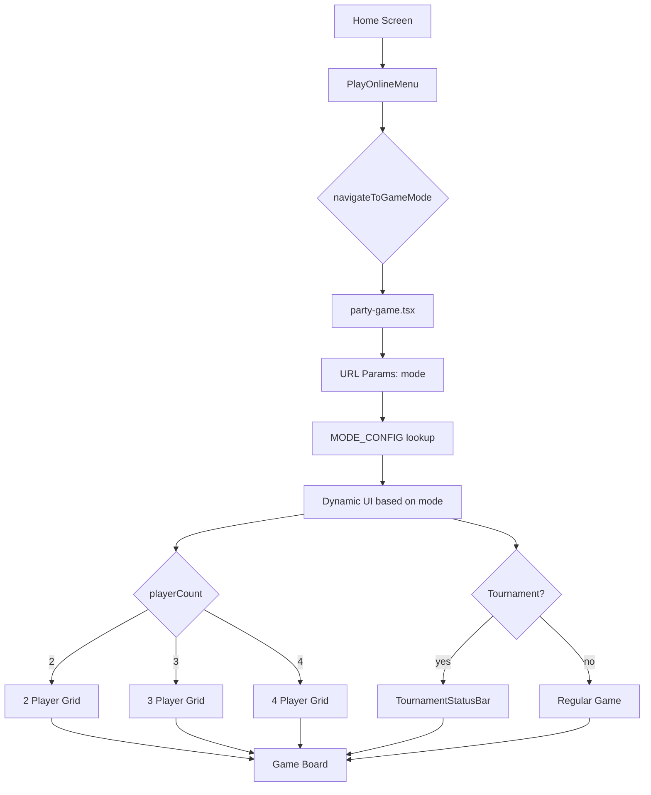

# Lobby Unification Plan

## Overview

Unify the multiplayer lobby systems by using the rich party-game.tsx as the standard lobby for all game modes (2, 3, and 4 players), while deprecating the simpler multiplayer.tsx approach.

## Current State Analysis

### 1. Multiplayer Approach (`/multiplayer.tsx`)
- **Lines 28-117**: Already accepts mode from URL via `useLocalSearchParams`
- Uses `DuelCard` component (simpler UI)
- Has `getModeInfo()` function for mode-specific titles
- Supports: two-hands, three-hands, four-hands, party, freeforall, tournament
- **No tournament support** - just basic lobby

### 2. Party-Game Approach (`/party-game.tsx`)
- **Line 85**: Hard-coded `mode: 'party'` - MUST CHANGE to accept URL param
- Uses player grid with avatars (rich UI)
- Has `TournamentStatusBar` component
- Has `SpectatorView` component  
- Has ping indicators and connection quality
- Currently designed for 4 players only (hard-coded in grid)

### 3. Routing (`components/home/useHomeScreen.ts`)
- **Lines 106-125**: `navigateToGameMode()` routes all modes to `/multiplayer`
- Need to change to route to `/party-game` instead

## Required Changes

### Step 1: Modify party-game.tsx to Accept Mode Parameter

**File**: `app/party-game.tsx`

**Add URL param reading** (around line 49):
```typescript
import { useLocalSearchParams } from 'expo-router';

// Inside PartyGameScreen:
const params = useLocalSearchParams<{ mode?: string }>();
const mode = (params.mode as GameMode) || 'party';
```

**Update useMultiplayerGame call** (line 85):
```typescript
// Change from:
} = useMultiplayerGame({ mode: 'party' });

// To:
} = useMultiplayerGame({ mode });
```

### Step 2: Create Mode Configuration

**Add mode configuration object** (after imports):
```typescript
type GameMode = 'two-hands' | 'three-hands' | 'four-hands' | 'party' | 'freeforall' | 'tournament';

const MODE_CONFIG: Record<GameMode, {
  title: string;
  subtitle: string;
  connectingSubtitle: string;
  playerCount: number;
  isTeamMode: boolean;
}> = {
  'two-hands': {
    title: '⚔️ 2 Hands',
    subtitle: '1v1 Battle',
    connectingSubtitle: 'Finding opponent for 2 hands',
    playerCount: 2,
    isTeamMode: false,
  },
  'three-hands': {
    title: '🎴 3 Hands',
    subtitle: '3 Player Battle',
    connectingSubtitle: 'Finding opponents for three hands',
    playerCount: 3,
    isTeamMode: false,
  },
  'four-hands': {
    title: '🎯 4 Hands',
    subtitle: '4 Player Free-For-All',
    connectingSubtitle: 'Finding opponents for four hands',
    playerCount: 4,
    isTeamMode: false,
  },
  'party': {
    title: '🎉 Party Mode',
    subtitle: '2v2 Battle',
    connectingSubtitle: 'Finding players for party mode',
    playerCount: 4,
    isTeamMode: true,
  },
  'freeforall': {
    title: '🎴 Free For All',
    subtitle: '4 Player Battle',
    connectingSubtitle: 'Finding opponents for free for all',
    playerCount: 4,
    isTeamMode: false,
  },
  'tournament': {
    title: '🏆 Tournament',
    subtitle: '4 Player Knockout',
    connectingSubtitle: 'Finding players for tournament',
    playerCount: 4,
    isTeamMode: false,
  },
};
```

### Step 3: Make Player Slots Dynamic

**File**: `app/party-game.tsx` - Player grid section (around lines 230-335)

**Replace hard-coded player slots** with dynamic generation:
```typescript
const modeConfig = MODE_CONFIG[mode];
const playerCount = modeConfig.playerCount;
const maxPlayers = playerCount;

// Dynamic player slots
const renderPlayerSlots = () => {
  const slots = [];
  
  // Your player is always first
  slots.push(/* render your player card */);
  
  // Render other player slots
  for (let i = 1; i < maxPlayers; i++) {
    const player = lobbyPlayers[i];
    const isFilled = player != null;
    slots.push(/* render player card */);
  }
  
  return slots;
};
```

### Step 4: Update Title/Subtitle Based on Mode

**Update header** (around line 199):
```typescript
<Text style={styles.headerTitle}>{modeConfig.title}</Text>
<Text style={styles.headerSubtitle}>{modeConfig.subtitle}</Text>
```

**Update connecting screen** (around line 172):
```typescript
<Text style={styles.connectingSubtitle}>{modeConfig.connectingSubtitle}</Text>
```

**Update player count display** (around line 232):
```typescript
<Text style={styles.sectionTitle}>
  Players ({playersInLobby}/{playerCount})
</Text>
```

### Step 5: Update useHomeScreen Routing

**File**: `components/home/useHomeScreen.ts`

**Change navigateToGameMode** (lines 106-125):
```typescript
const navigateToGameMode = (mode: GameModeOption) => {
  setPlayOnlineMenuVisible(false);
  // Route ALL modes to party-game instead of multiplayer
  router.push(`/party-game?mode=${mode}` as any);
};
```

## Architecture Diagram



## Testing Checklist

- [ ] Two-hands mode (2 players) renders correctly
- [ ] Three-hands mode (3 players) renders correctly  
- [ ] Four-hands mode (4 players) renders correctly
- [ ] Party mode (2v2) renders correctly
- [ ] Free-for-all mode renders correctly
- [ ] Tournament mode shows TournamentStatusBar
- [ ] Title updates based on mode
- [ ] Subtitle updates based on mode
- [ ] Player slots dynamically adjust
- [ ] Connection to server works for all modes
- [ ] Game starts correctly for all modes

## Migration Path

1. First, modify party-game.tsx to accept mode parameter
2. Test each mode individually
3. Update useHomeScreen to route to party-game
4. Keep multiplayer.tsx as fallback during transition
5. Once verified, consider deprecating multiplayer.tsx

## Benefits

1. **Single unified lobby** - One codebase to maintain
2. **Rich UI for all modes** - All players get avatars, ping, notifications
3. **Tournament support** - Built-in for all 4-player modes
4. **Scalable** - Easy to add new modes
5. **Better player experience** - Consistent UI across all game modes
