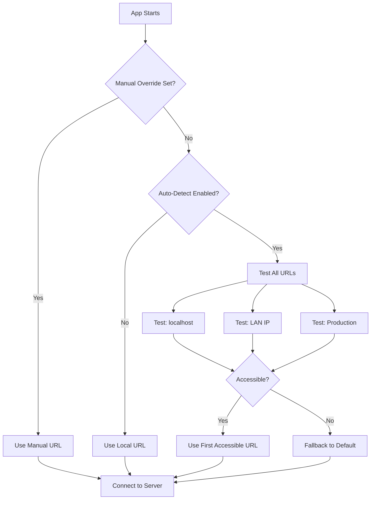

# Mobile Multiplayer Connection Fix Plan

## Problem

On mobile devices, the multiplayer connection fails because the socket connects to `localhost`, which points to the mobile device itself rather than the host computer running the server.

## Solution Overview

Use the existing [`utils/serverUrl.ts`](../../utils/serverUrl.ts) utility that provides:
- Auto-detection of the best server URL based on network context
- Support for local, LAN, and production URLs
- Fallback mechanism if auto-detection fails

## Implementation Steps

### Step 1: Update useGameState.ts

Replace the static socket URL with dynamic resolution using `ServerUrlResolver`.

```typescript
// hooks/useGameState.ts - Changes needed

import { getOptimalServerUrl } from '../utils/serverUrl';

// Remove the static SOCKET_URL constant
// const SOCKET_URL = process.env.EXPO_PUBLIC_SOCKET_URL || 'http://localhost:3001';

export function useGameState(): UseGameStateResult {
  const socketRef = useRef<Socket | null>(null);
  const [isConnecting, setIsConnecting] = useState(true);

  useEffect(() => {
    // Get optimal URL and connect
    const initSocket = async () => {
      const socketUrl = await getOptimalServerUrl();
      console.log('[useGameState] Connecting to:', socketUrl);
      
      const socket = io(socketUrl, {
        transports: ['websocket', 'polling'], // Polling as fallback
        reconnection: true,
        reconnectionAttempts: 5,
        reconnectionDelay: 1000,
      });
      socketRef.current = socket;

      // Rest of the socket setup...
    };

    initSocket();
  }, []);
}
```

### Step 2: Update usePartyGameState.ts

Apply the same changes to the party game state hook.

```typescript
// hooks/usePartyGameState.ts - Changes needed

import { getOptimalServerUrl } from '../utils/serverUrl';

export function usePartyGameState(): UsePartyGameStateResult {
  const socketRef = useRef<Socket | null>(null);
  const [isConnecting, setIsConnecting] = useState(true);

  useEffect(() => {
    const initSocket = async () => {
      const socketUrl = await getOptimalServerUrl();
      console.log('[usePartyGameState] Connecting to:', socketUrl);
      
      const socket = io(socketUrl, {
        transports: ['websocket', 'polling'],
        reconnection: true,
        reconnectionAttempts: 5,
        reconnectionDelay: 1000,
      });
      socketRef.current = socket;
      
      // Rest of socket setup...
    };

    initSocket();
  }, []);
}
```

### Step 3: Update .env Configuration

Configure the environment variables for proper auto-detection.

```env
# .env configuration

# Enable auto-detection (scans network for server)
AUTODETECT_ENABLED=true

# Local URL (used on desktop - same machine as server)
SOCKET_URL_LOCAL=http://localhost:3001

# LAN URL (used on mobile - your computer's local IP)
# Replace 192.168.x.x with your actual local IP address
SOCKET_URL_LAN=http://192.168.1.100:3001

# Production URL (optional - for deployed server)
# SOCKET_URL_PRODUCTION=https://your-production-server.com

# Fallback (if auto-detection fails)
EXPO_PUBLIC_SOCKET_URL=http://localhost:3001
```

## How Auto-Detection Works



## Finding Your Local IP Address

### Windows
```cmd
ipconfig
```
Look for IPv4 Address under your active network adapter (e.g., `192.168.1.100`)

### macOS
```bash
ifconfig
```
or
```bash
ip a
```
Look for `inet` address (e.g., `192.168.1.100`)

### Linux
```bash
ip a
```
or
```bash
hostname -I
```

## Testing the Fix

1. Find your computer's local IP address
2. Update `SOCKET_URL_LAN` in `.env` with your IP
3. Restart Expo: `npx expo start --clear`
4. On mobile, ensure you're on the same Wi-Fi network
5. The auto-detection will:
   - Try localhost first (fails on mobile)
   - Fall back to LAN IP (succeeds if on same network)
   - Connect to the server

## Troubleshooting

| Issue | Solution |
|-------|----------|
| Connection still fails | Verify both devices on same Wi-Fi |
| Can't find IP | Check router settings or run `arp -a` |
| Auto-detection slow | Reduce timeout in `serverUrl.ts` |
| WebSocket blocked | Polling fallback is enabled by default |

## Files Modified

- `hooks/useGameState.ts` - Use dynamic URL resolution
- `hooks/usePartyGameState.ts` - Use dynamic URL resolution
- `.env` - Configure URLs and auto-detection
