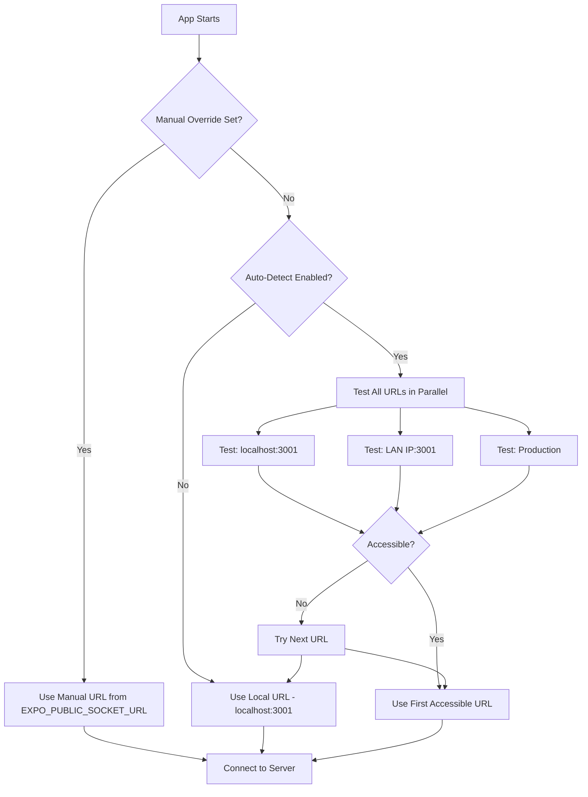

# Mobile Multiplayer Connection Fix Plan

## Problem

On mobile devices, the multiplayer connection fails because the socket connects to `localhost`, which points to the mobile device itself rather than the host computer running the server.

## Current State Analysis

### Existing Solution Available

The project already has a [`utils/serverUrl.ts`](../../utils/serverUrl.ts) utility with auto-detection logic, but it's **not being used** by the game hooks. The utility provides:
- Auto-detection of the best server URL based on network context
- Support for local, LAN, and production URLs  
- Fallback mechanism if auto-detection fails

### Issue with ServerUrlResolver

The current `ServerUrlResolver` has a hardcoded LAN IP that may not match your network:

```typescript
// utils/serverUrl.ts:34
lanUrl: process.env.SOCKET_URL_LAN || 'http://192.168.18.14:3001',
```

This needs to be updated to read from environment variables properly.

---

## Solution Options

### Option A: Quick Fix (Recommended for Testing)

Simply update `.env` to use your local IP directly - no code changes needed:

```env
EXPO_PUBLIC_SOCKET_URL=http://192.168.1.100:3001
```

**Pros:** Simple, no code changes  
**Cons:** Manual IP configuration required for each network

### Option B: Full Auto-Detection (More Robust)

Use the existing `ServerUrlResolver` utility with proper configuration:

1. Update `.env` with your LAN IP and enable auto-detection
2. Update hooks to use async URL resolution
3. Add polling fallback for firewall issues

**Pros:** Works automatically across different networks  
**Cons:** Requires code changes

---

## Implementation: Option B (Full Solution)

### Step 1: Update .env Configuration

```env
# .env configuration

# Enable auto-detection (scans network for server)
AUTODETECT_ENABLED=true

# Local URL (used on desktop - same machine as server)
SOCKET_URL_LOCAL=http://localhost:3001

# LAN URL (used on mobile - your computer's local IP)
# IMPORTANT: Replace 192.168.1.100 with your actual local IP address
SOCKET_URL_LAN=http://192.168.1.100:3001

# Default fallback
EXPO_PUBLIC_SOCKET_URL=http://localhost:3001
```

### Step 2: Update useGameState.ts

Replace the static socket URL with dynamic resolution:

```typescript
// hooks/useGameState.ts - Changes needed

import { getOptimalServerUrl } from '../utils/serverUrl';

// REMOVE this static constant:
// const SOCKET_URL = process.env.EXPO_PUBLIC_SOCKET_URL || 'http://localhost:3001';

export function useGameState(): UseGameStateResult {
  const socketRef = useRef<Socket | null>(null);
  const [isConnecting, setIsConnecting] = useState(true);

  useEffect(() => {
    // Get optimal URL and connect
    const initSocket = async () => {
      const socketUrl = await getOptimalServerUrl();
      console.log('[useGameState] Connecting to:', socketUrl);
      
      const socket = io(socketUrl, {
        transports: ['websocket', 'polling'], // Polling as fallback
        reconnection: true,
        reconnectionAttempts: 5,
        reconnectionDelay: 1000,
      });
      socketRef.current = socket;

      // Socket event handlers remain the same...
      socket.on('connect', () => setIsConnected(true));
      socket.on('disconnect', () => setIsConnected(false));
      // ... rest of event handlers
    };

    initSocket();

    return () => {
      socketRef.current?.disconnect();
    };
  }, []);
}
```

### Step 3: Update usePartyGameState.ts

Apply the same changes to the party game hook:

```typescript
// hooks/usePartyGameState.ts - Changes needed

import { getOptimalServerUrl } from '../utils/serverUrl';

export function usePartyGameState(): UsePartyGameStateResult {
  const socketRef = useRef<Socket | null>(null);
  const [isConnecting, setIsConnecting] = useState(true);

  useEffect(() => {
    const initSocket = async () => {
      const socketUrl = await getOptimalServerUrl();
      console.log('[usePartyGameState] Connecting to:', socketUrl);
      
      const socket = io(socketUrl, {
        transports: ['websocket', 'polling'],
        reconnection: true,
        reconnectionAttempts: 5,
        reconnectionDelay: 1000,
      });
      socketRef.current = socket;
      
      // Socket event handlers remain the same...
    };

    initSocket();

    return () => {
      socketRef.current?.disconnect();
    };
  }, []);
}
```

---

## Finding Your Local IP Address

### Windows
```cmd
ipconfig
```
Look for IPv4 Address (e.g., `192.168.1.100`)

### macOS
```bash
ifconfig
```
or
```bash
ip a
```

### Quick Test
1. Start the socket server: `node multiplayer/server/socket-server.js`
2. On your computer, test: `curl http://localhost:3001`
3. On mobile (same Wi-Fi), test: `http://192.168.1.100:3001`

---

## How Auto-Detection Works



---

## Troubleshooting

| Issue | Solution |
|-------|----------|
| Connection fails on mobile | Verify IP address in `.env` matches your computer |
| Can't find IP | Run `arp -a` on Windows to see devices on network |
| WebSocket blocked | Polling fallback is now enabled |
| Auto-detection slow | Check network firewall settings |

---

## Recommendation

**Start with Option A (quick fix):**

1. Run `ipconfig` to find your local IP
2. Set `EXPO_PUBLIC_SOCKET_URL=http://YOUR_IP:3001` in `.env`
3. Restart Expo: `npx expo start --clear`
4. Test on mobile

If you need the auto-detection feature working properly, implement Option B afterwards.

---

## Files to Modify

| File | Change |
|------|--------|
| `.env` | Add/update SOCKET_URL_LAN and EXPO_PUBLIC_SOCKET_URL |
| `hooks/useGameState.ts` | Use async URL resolution |
| `hooks/usePartyGameState.ts` | Use async URL resolution |
