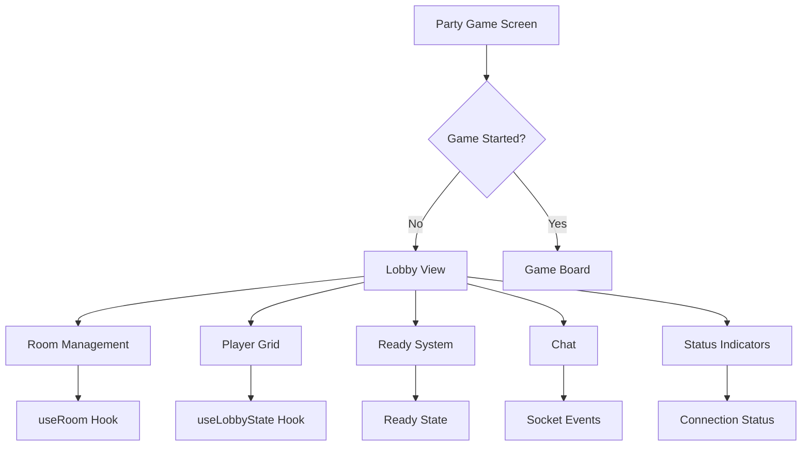

# Multiplayer Lobby Upgrade Plan

## Overview
Upgrade the party game lobby system to match the visual style and functionality of the private room, with advanced features including queue display, player management, chat, and real-time status indicators.

## Current State Analysis

### Party Game (`app/party-game.tsx`)
- Uses simple matchmaking (no room codes)
- Basic lobby showing 4 player slots with emoji (✅/⏳)
- Only displays player count, not individual player details
- Simple white card styling
- No chat, ready system, or room management

### Private Room (`app/private-room.tsx`)
- Entry point for room-based multiplayer
- Game mode selection (duel/party)
- Create/join room flow
- Modern green gradient styling

### Available Hooks
- `useRoom`: Full room management (create, join, leave, start game)
- `useLobbyState`: Basic party lobby tracking
- `useGameStateSync`: Game state synchronization
- `useSocketConnection`: Socket connection management

## Upgrade Requirements

### 1. Queue Display System
- Show players waiting to join in a grid/list layout
- Display avatar, username, and status for each player
- Real-time updates when players join/leave
- Player capacity information (X/Y players)
- Matchmaking status indicator

### 2. Enhanced Visual Styling
- Match private room's gradient backgrounds (#0f4d0f green theme)
- Use same button styles (gold #FFD700)
- Card components with proper shadows and borders
- Consistent typography
- Responsive layout

### 3. Room Management
- Room creation with auto-generated codes
- Join room by entering code
- Display room code prominently
- Host controls (kick players, start game)
- Player kick/admin controls

### 4. Ready System
- Ready/not ready toggle for each player
- Visual indicator (checkmark, color change)
- Game only starts when all players ready
- Host can force start

### 5. Real-time Status Indicators
- Ping/connection quality (green/yellow/red dots)
- Player connected/disconnected status
- Animated join/leave notifications

### 6. Chat Functionality
- Simple text chat in lobby
- Message input field
- Auto-scroll to new messages
- Player name prefixes

### 7. Room Settings (Future)
- Max players selector
- Private/public toggle
- Game options

## Implementation Plan

### Phase 1: Core UI Framework
1. Update `app/party-game.tsx` to use room-based flow
2. Create enhanced lobby card component
3. Add gradient background styling
4. Implement responsive layout

### Phase 2: Player Management
1. Update `useLobbyState` to track player details
2. Add player list with avatars and usernames
3. Implement ready status tracking
4. Add kick functionality for host

### Phase 3: Real-time Features
1. Add connection quality indicators
2. Implement join/leave animations
3. Add chat functionality
4. Error handling for connection issues

### Phase 4: Polish
1. Add smooth transitions
2. Test on various screen sizes
3. Final styling adjustments

## Technical Changes

### Files to Modify:
1. `app/party-game.tsx` - Major rewrite for enhanced lobby
2. `hooks/multiplayer/useLobbyState.ts` - Add player details tracking
3. `hooks/multiplayer/useRoom.ts` - Potentially extend for ready system

### New Components (Optional):
- `components/lobby/PlayerCard.tsx` - Individual player display
- `components/lobby/PlayerGrid.tsx` - Grid of players
- `components/lobby/ChatPanel.tsx` - Chat functionality
- `components/lobby/ReadyButton.tsx` - Ready toggle

## Architecture

## Success Criteria
- [ ] Players displayed with avatars and usernames
- [ ] Real-time ready/not ready indicators
- [ ] Room creation with code display
- [ ] Join room by code functionality
- [ ] Chat messages work in lobby
- [ ] Connection quality indicators visible
- [ ] Smooth animations on player join/leave
- [ ] Visual styling matches private room
- [ ] Responsive on different screen sizes
- [ ] Error handling for connection issues
