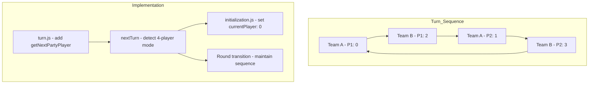

# Party Game Turn Order Implementation Plan

## Overview

This plan implements a specific turn sequence for 4-player party games where turns alternate between teams and players in a defined order: Team A Player 1 → Team B Player 1 → Team A Player 2 → Team B Player 2 → repeat.

## Current Behavior Analysis

### Current Turn System
- **File**: [`shared/game/turn.js`](shared/game/turn.js)
- **Current Logic**: Uses simple modulo advancement: `(currentPlayer + 1) % totalPlayers`
- **Current Order for 4 players**: 0 → 1 → 2 → 3 → 0 → ...
- **Team Assignment**: Players 0,1 = Team A; Players 2,3 = Team B

### Required Turn Order
- **Team A Player 1** (index 0)
- **Team B Player 1** (index 2)
- **Team A Player 2** (index 1)
- **Team B Player 2** (index 3)
- **Repeat** → back to Team A Player 1

---

## Architecture



---

## Implementation Steps

### Step 1: Add Turn Sequence Helper to turn.js

**File**: [`shared/game/turn.js`](shared/game/turn.js)

Add a function to get the next player based on party game order:

```javascript
/**
 * Get the next player in party game turn sequence.
 * Order: Team A P1 (0) → Team B P1 (2) → Team A P2 (1) → Team B P2 (3) → repeat
 * @param {number} currentPlayer - Current player index (0-3)
 * @returns {number} Next player index
 */
function getNextPartyPlayer(currentPlayer) {
  // Party game turn sequence for 4 players
  const partyTurnSequence = [0, 2, 1, 3];
  const currentIndex = partyTurnSequence.indexOf(currentPlayer);
  
  if (currentIndex === -1) {
    // Not in sequence, default to next in sequence
    return partyTurnSequence[0];
  }
  
  const nextIndex = (currentIndex + 1) % partyTurnSequence.length;
  return partyTurnSequence[nextIndex];
}

/**
 * Check if game should use party turn order (4 players)
 * @param {number} playerCount - Number of players
 * @returns {boolean} True if party turn order should be used
 */
function usePartyTurnOrder(playerCount) {
  return playerCount === 4;
}
```

### Step 2: Modify nextTurn Function

**File**: [`shared/game/turn.js`](shared/game/turn.js:207)

Update the `nextTurn` function to use party order for 4-player games:

```javascript
function nextTurn(state) {
  const totalPlayers = state.players.length;
  const oldPlayer = state.currentPlayer;
  
  let newPlayer;
  
  // Use party turn order for 4-player games
  if (usePartyTurnOrder(totalPlayers)) {
    newPlayer = getNextPartyPlayer(oldPlayer);
  } else {
    // Standard sequential order for 2-player
    newPlayer = (state.currentPlayer + 1) % totalPlayers;
  }

  // ... rest of existing logic remains the same
  state.currentPlayer = newPlayer;
  // ...
}
```

### Step 3: Add Helper to Team Module

**File**: [`shared/game/team.js`](shared/game/team.js)

Add helper functions for party turn sequence:

```javascript
/**
 * Get the party turn sequence for 4-player games.
 * @returns {number[]} Array of player indices in turn order
 */
function getPartyTurnSequence() {
  return [0, 2, 1, 3];
}

/**
 * Get the position in turn sequence for a player.
 * @param {number} playerIndex - Player index (0-3)
 * @returns {number} Position in sequence (0-3) or -1 if not in sequence
 */
function getPositionInSequence(playerIndex) {
  const sequence = getPartyTurnSequence();
  return sequence.indexOf(playerIndex);
}

/**
 * Check if it's the first player in turn sequence.
 * @param {number} playerIndex - Player index
 * @returns {boolean} True if player is Team A Player 1 (index 0)
 */
function isFirstInSequence(playerIndex) {
  return playerIndex === 0;
}
```

### Step 4: Ensure Game Initialization Uses Correct Starting Player

**File**: [`shared/game/initialization.js`](shared/game/initialization.js:41)

Verify `currentPlayer: 0` is set (already correct - Team A Player 1 starts):

```javascript
const state = {
  // ... other fields
  currentPlayer: 0,  // Team A Player 1 starts - confirmed correct
  // ...
};
```

### Step 5: Handle Round Transitions

**File**: [`shared/game/round.js`](shared/game/round.js)

Ensure round transitions maintain turn sequence:

```javascript
function startNextRound(state, playerCount) {
  // ... existing code ...
  
  // Reset to Team A Player 1 for new round
  // For party games, 0 is Team A P1 in the sequence
  newState.currentPlayer = 0;
  newState.round = state.round + 1;
  newState.turnCounter = 1;
  
  // ... rest of existing logic
}
```

### Step 6: Update TypeScript Types

**File**: [`types/game.types.ts`](types/game.types.ts)

Add party turn sequence type:

```typescript
// Party turn sequence for 4-player games
export const PARTY_TURN_SEQUENCE = [0, 2, 1, 3] as const;
export type PartyTurnSequence = typeof PARTY_TURN_SEQUENCE;

// Helper function
export function getNextPartyPlayer(currentPlayer: number): number {
  const sequence = PARTY_TURN_SEQUENCE;
  const currentIndex = sequence.indexOf(currentPlayer);
  if (currentIndex === -1) return sequence[0];
  return sequence[(currentIndex + 1) % sequence.length];
}
```

### Step 7: Edge Case - Handle Player Disconnection

**File**: [`shared/game/turn.js`](shared/game/turn.js)

Add function to handle disconnection skipping:

```javascript
/**
 * Skip a player's turn due to disconnection.
 * Move to next player in sequence.
 * @param {object} state - Game state
 * @param {number} disconnectedPlayerIndex - Index of disconnected player
 * @returns {object} Updated state
 */
function skipDisconnectedPlayer(state, disconnectedPlayerIndex) {
  const totalPlayers = state.players.length;
  let nextPlayer;
  
  if (usePartyTurnOrder(totalPlayers)) {
    nextPlayer = getNextPartyPlayer(disconnectedPlayerIndex);
  } else {
    nextPlayer = (disconnectedPlayerIndex + 1) % totalPlayers;
  }
  
  // Mark the disconnected player's turn as skipped
  if (state.roundPlayers && state.roundPlayers[disconnectedPlayerIndex]) {
    state.roundPlayers[disconnectedPlayerIndex].turnSkipped = true;
    state.roundPlayers[disconnectedPlayerIndex].turnEnded = true;
  }
  
  state.currentPlayer = nextPlayer;
  console.log(`[turn] Skipped disconnected player ${disconnectedPlayerIndex}, now Player ${nextPlayer}'s turn`);
  
  return state;
}
```

---

## Integration Points

| File | Changes | Purpose |
|------|---------|---------|
| [`shared/game/turn.js`](shared/game/turn.js) | Add `getNextPartyPlayer()`, `usePartyTurnOrder()`, modify `nextTurn()`, add `skipDisconnectedPlayer()` | Core turn sequence logic |
| [`shared/game/team.js`](shared/game/team.js) | Add `getPartyTurnSequence()`, `getPositionInSequence()`, `isFirstInSequence()` | Team helper functions |
| [`shared/game/round.js`](shared/game/round.js) | Verify round transition maintains sequence | Round continuity |
| [`shared/game/initialization.js`](shared/game/initialization.js) | Verify `currentPlayer: 0` | Game start |
| [`types/game.types.ts`](types/game.types.ts) | Add party turn sequence types | TypeScript support |

---

## Testing Scenarios

1. **Initial Game Start**: Verifies currentPlayer = 0 (Team A P1)
2. **Turn Progression**: 0 → 2 → 1 → 3 → 0 → ... (correct order)
3. **Round Reset**: After round ends, currentPlayer resets to 0
4. **4-Player Only**: 2-player games should use standard 0→1→2→0 order
5. **Disconnection**: When player disconnects, turn skips to next in sequence
6. **Reconnection**: When player reconnects, they wait for their turn in sequence

---

## Summary

This implementation:
- ✅ Maintains deterministic turn order: Team A P1 → Team B P1 → Team A P2 → Team B P2
- ✅ Works for 4-player party games only
- ✅ Preserves 2-player behavior unchanged
- ✅ Handles round transitions seamlessly
- ✅ Provides edge case handling for disconnections
