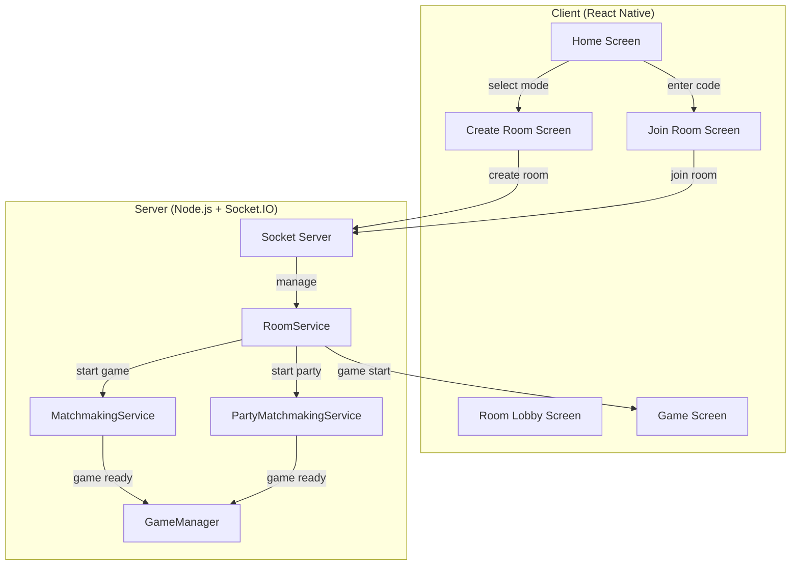

# Private Rooms Plan - Room Code Instead of Random Matchmaking

## Overview
Add private room functionality where players can create a room with a unique code and invite friends to join, rather than using random matchmaking. This feature should support both 2-player duel and 4-player party modes.

## Architecture Diagram



## Todo List

### Phase 1: Server-Side Room Management

#### 1. Create RoomService
- File: `multiplayer/server/services/RoomService.js`
- Store rooms by code: `Map<roomCode, { gameId, hostSocketId, players[], maxPlayers, status, gameMode }>`
- Methods:
  - `createRoom(hostSocket, gameMode, maxPlayers)`: Generate 6-char alphanumeric code, create room, return code
  - `joinRoom(socket, roomCode)`: Add player to room, return success/error
  - `leaveRoom(socket)`: Remove player, cleanup if empty
  - `getRoomStatus(roomCode)`: Return current room state
  - `startGame(roomCode)`: Trigger game start via matchmaking
  - `cleanupExpiredRooms()`: Remove rooms with no activity (optional)
- Room statuses: `waiting`, `ready`, `started`, `closed`

#### 2. Add Socket Events
- File: `multiplayer/server/socket-server.js`
- New events:
  - `create-room`: `{ gameMode: 'duel'|'party', maxPlayers: 2|4 }` → Returns `{ roomCode, status }`
  - `join-room`: `{ roomCode: string }` → Returns `{ success, roomStatus, error? }`
  - `leave-room`: No payload → Returns `{ success }`
  - `room-status`: `{ roomCode }` → Returns `{ players: [], status, maxPlayers }`
  - `start-room-game`: Host only → Triggers game start

#### 3. Update MatchmakingService
- Modify to accept optional `roomCode` parameter
- When room provided, skip queue and start game directly with room players
- Add method: `startRoomGame(roomCode, players)`

#### 4. Update PartyMatchmakingService
- Similar modifications for 4-player rooms
- Support both 2 and 4 player counts

### Phase 2: Client-Side Room Management

#### 5. Create useRoom Hook
- File: `hooks/multiplayer/useRoom.ts`
- Interface:
  ```typescript
  interface RoomState {
    roomCode: string | null;
    gameMode: 'duel' | 'party';
    status' | 'waiting' | 'ready' | 'started' | 'error: 'none';
    players: Array<{ socketId: string, isHost: boolean }>;
    maxPlayers: number;
    error: string | null;
  }
  ```
- Methods:
  - `createRoom(gameMode, maxPlayers)`: Creates room, returns code
  - `joinRoom(roomCode)`: Joins room by code
  - `leaveRoom()`: Leaves current room
  - `startGame()`: Host starts game when ready

#### 6. Update useSocketConnection
- File: `hooks/multiplayer/useSocketConnection.ts`
- Add optional `roomCode` parameter to options
- When roomCode provided, emit `join-room` instead of random matchmaking
- Handle room-specific events: `room-created`, `room-joined`, `room-updated`, `room-error`, `room-game-start`

### Phase 3: UI Screens

#### 7. Create Room Screens
- `app/create-room.tsx`: 
  - Select game mode (duel/party)
  - Display generated room code
  - Show "waiting for players" status
  - "Start Game" button (enabled when room full)
  - "Cancel" button to close room
  
- `app/join-room.tsx`:
  - Input field for 6-character room code
  - "Join" button
  - Error display for invalid codes
  - On success, transition to room lobby

- `app/room-lobby.tsx`:
  - Shows all players in room
  - Host sees "Start Game" button
  - Non-hosts see "Waiting for host..."
  - "Leave Room" button

#### 8. Update Home Screen Navigation
- Modify `app/(tabs)/index.tsx`
- Flow:
  ```
  Home Screen
    ├── Vs AI → cpu-game
    ├── Multiplayer (2-player)
    │   ├── Find Random Match → multiplayer
    │   ├── Create Private Room → create-room (duel)
    │   └── Join Private Room → join-room → room-lobby
    └── Party Mode (4-player)
        ├── Find Random Match → party-game
        ├── Create Private Room → create-room (party)
        └── Join Private Room → join-room → room-lobby
  ```

### Phase 4: Edge Cases & Error Handling

#### 9. Error Handling
- Invalid room code → "Room not found" error
- Room full → "Room is full" error
- Host disconnects → Transfer host to next player OR close room
- Player disconnects during waiting → Remove from room, notify others
- Player disconnects during game → Handle via existing disconnect logic
- Network errors → Show reconnect option

#### 10. Room Lifecycle
- Create → Waiting (players join) → Ready (room full) → Started (game begins) → Closed (game ends)
- Auto-cleanup: Remove rooms after 30 minutes of inactivity

## Files to Create
1. `multiplayer/server/services/RoomService.js` - Server room management

## Files to Modify
1. `multiplayer/server/socket-server.js` - Add room socket events
2. `multiplayer/server/services/MatchmakingService.js` - Support room-based start
3. `multiplayer/server/services/PartyMatchmakingService.js` - Support room-based start
4. `multiplayer/server/services/GameCoordinatorService.js` - Handle room games
5. `hooks/multiplayer/useSocketConnection.ts` - Support room connection
6. `hooks/multiplayer/index.ts` - Export new room hook
7. `app/(tabs)/index.tsx` - Update navigation
8. `app/create-room.tsx` - Create room UI (new file)
9. `app/join-room.tsx` - Join room UI (new file)
10. `app/room-lobby.tsx` - Room lobby UI (new file)

## Room Code Format
- 6-character alphanumeric uppercase string
- Example: `ABC123`, `XY789Z`
- Generation: Random selection from `A-Z0-9` (36^6 = 2 billion+ possible codes)

## Implementation Order
1. Server-side RoomService (foundational)
2. Socket server event handlers
3. Client useRoom hook
4. UI screens
5. Integration and testing

## Notes
- Keep existing random matchmaking functionality intact for players who prefer it
- Room codes should be case-insensitive on input
- Display room code prominently with copy-to-clipboard option
- Consider adding QR code sharing for easier room sharing (future enhancement)
