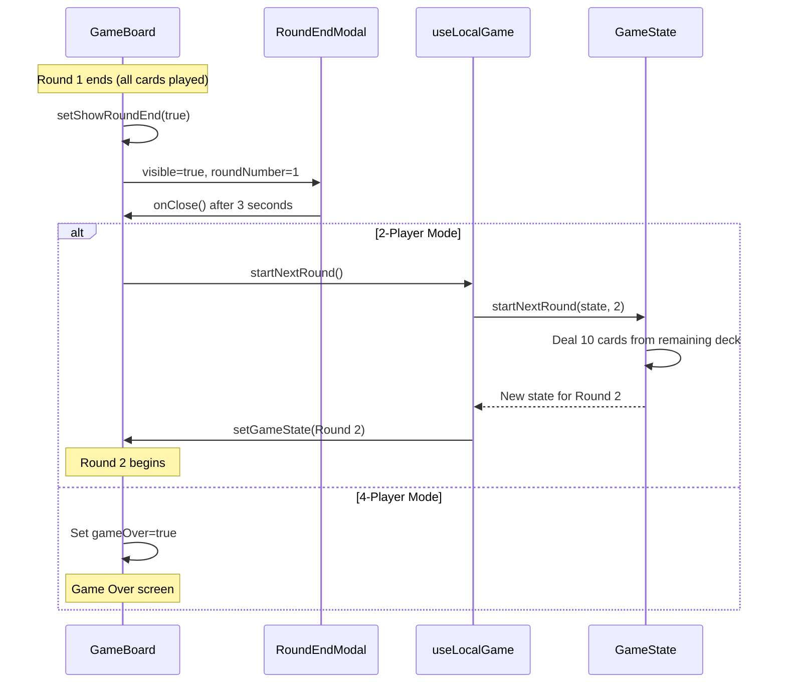

# Round 1 → Round 2 Transition Plan

## Overview
When Round 1 ends and the Round 1 End Modal is triggered, the system must automatically prepare and start Round 2 by dealing 10 new cards to each player from the remaining deck.

## Requirements
- **2-player mode (CPU)**: Exactly 2 rounds total
- **4-player mode (Party)**: Exactly 1 round (game ends after Round 1)
- Use the same deck for both rounds - deal from remaining cards
- Each player receives 10 new cards from the remaining deck for Round 2

## Current Behavior (Problem)
- [`useLocalGame.ts`](hooks/game/useLocalGame.ts:135) `startNextRound()` calls `createInitialGameState()` which creates a **completely new game** with a fresh 40-card deck
- This is incorrect - we need to use the **remaining deck** from Round 1

## Implementation Plan

### Step 1: Add `startNextRound` function in GameState.js
**File**: `shared/game/GameState.js`

Create a new function `startNextRound(state, playerCount)` that:
1. Checks if a next round is allowed based on player count:
   - 2-player: Allow if current round < 2
   - 4-player: Never allow (1 round only)
2. Gets the remaining deck from `state.deck`
3. Deals 10 new cards to each player from the remaining deck
4. Clears table cards (new empty table for new round)
5. Resets turn tracking (`roundPlayers`, `currentPlayer = 0`, `turnCounter = 1`)
6. Increments `state.round`
7. Keeps existing scores and teamScores

```javascript
/**
 * Start the next round by dealing cards from the remaining deck.
 * @param {object} state - Current game state
 * @param {number} playerCount - Number of players (2 or 4)
 * @returns {object|null} Updated state or null if no more rounds allowed
 */
function startNextRound(state, playerCount) {
  // For 4-player: only 1 round allowed (no Round 2)
  if (playerCount >= 4) {
    console.log('[GameState] startNextRound: 4-player mode, no Round 2 allowed');
    return null;
  }
  
  // For 2-player: allow up to 2 rounds
  if (state.round >= 2) {
    console.log('[GameState] startNextRound: Round 2 already completed');
    return null;
  }
  
  // Check if we have enough cards in the deck
  const cardsNeeded = playerCount * STARTING_CARDS_PER_PLAYER; // 20 for 2-player
  if (state.deck.length < cardsNeeded) {
    console.log(`[GameState] startNextRound: Not enough cards in deck (have ${state.deck.length}, need ${cardsNeeded})`);
    return null;
  }
  
  // Deal 10 new cards to each player from remaining deck
  const newPlayers = state.players.map(player => ({
    ...player,
    hand: state.deck.splice(0, STARTING_CARDS_PER_PLAYER),
    // Keep captures from previous round
  }));
  
  // Return updated state for next round
  return {
    ...state,
    deck: state.deck,
    players: newPlayers,
    tableCards: [],
    currentPlayer: 0,
    round: state.round + 1,
    turnCounter: 1,
    moveCount: 0,
    // Reset round players for turn tracking
    roundPlayers: createRoundPlayers(playerCount),
  };
}
```

### Step 2: Export the new function
**File**: `shared/game/GameState.js`

Add to module.exports:
```javascript
module.exports = {
  // ... existing exports
  startNextRound,
};
```

### Step 3: Update useLocalGame.ts
**File**: `hooks/game/useLocalGame.ts`

Modify `startNextRound` callback to use the new GameState function:

```typescript
// Import the new function
const { startNextRound: startNextRoundFromState } = require('../../shared/game/GameState');

// Update startNextRound callback
const startNextRound = useCallback(() => {
  setGameState(prev => {
    // Try to start next round from remaining deck
    const newState = startNextRoundFromState(prev, playerCount);
    if (newState) {
      // Round 2 started successfully - keep scores
      return {
        ...newState,
        scores: prev.scores,
        teamScores: prev.teamScores || [0, 0],
      };
    }
    
    // If null returned, no more rounds allowed - end the game
    console.log('[useLocalGame] No more rounds allowed, ending game');
    return {
      ...prev,
      gameOver: true,
    };
  });
}, [playerCount]);
```

### Step 4: Update RoundEndModal for auto-transition
**File**: `components/modals/RoundEndModal.tsx`

For Round 1 in 2-player mode, the modal already auto-dismisses after 3 seconds. The `onClose` callback should trigger the next round automatically when:
- Round 1 just ended
- 2-player mode (not 4-player)
- Round 2 is allowed

**Option A**: Pass a flag to indicate auto-advance is desired
**Option B**: Handle the auto-advance in GameBoard based on player count

Let's use Option B - modify GameBoard to handle auto-transition.

### Step 5: Update GameBoard for auto-transition
**File**: `components/game/GameBoard.tsx`

The RoundEndModal's `onClose` handler currently just hides the modal. We need to:
1. When Round 1 ends and 2-player mode → auto-call `startNextRound`
2. When Round 1 ends and 4-player mode → show "Game Over" (current behavior)

```typescript
// In GameBoard component
const isTwoPlayerMode = gameState.playerCount === 2;
const canContinueToRound2 = isTwoPlayerMode && roundInfo.roundNumber === 1;

// Handle modal close - auto-advance for Round 1 in 2-player mode
const handleRoundEndClose = () => {
  setShowRoundEnd(false);
  if (canContinueToRound2 && startNextRound) {
    // Auto-start Round 2
    startNextRound();
  }
};

// Update RoundEndModal props
<RoundEndModal
  visible={showRoundEnd}
  roundNumber={roundInfo.roundNumber}
  endReason={roundInfo.endReason}
  scores={gameState.scores as [number, number]}
  onNextRound={() => {
    setShowRoundEnd(false);
    if (startNextRound) {
      startNextRound();
    }
  }}
  onClose={handleRoundEndClose}
/>
```

### Step 6: Multiplayer considerations
**File**: `hooks/useGameState.ts`

The multiplayer `startNextRound` emits to server:
```typescript
const startNextRound = () => {
  socketRef.current?.emit('start-next-round');
};
```

The server would need similar logic to handle round transitions. This is likely handled in `GameCoordinatorService.js` or similar.

## Summary of Changes

| File | Change |
|------|--------|
| `shared/game/GameState.js` | Add `startNextRound(state, playerCount)` function |
| `hooks/game/useLocalGame.ts` | Use new GameState function for round transitions |
| `components/game/GameBoard.tsx` | Auto-advance from Round 1 to Round 2 in 2-player mode |

## Mermaid Flow Diagram


