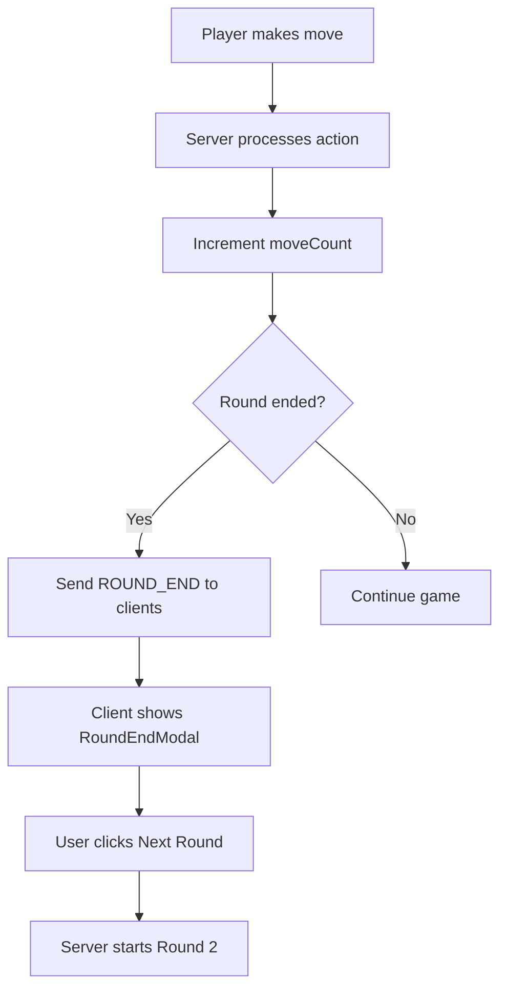

# Round End Detection Plan (Approach 4)

## Overview
Implement Approach 4 for detecting when Round 1 ends in the card game:
- **Round 1 ends when**: Both players have 0 cards OR 20 moves have been played
- **After round ends**: Show modal with scores, then advance to Round 2

## Architecture



## Implementation Steps

### 1. Server-side: Add moveCount tracking to GameState

**File: `multiplayer/server/game/GameState.js`**

- Add `moveCount: 0` to initial state in `initializeGame()`
- Add `moveCount: 0` to initial state in `initializeTestGame()`
- Update `nextTurn()` to increment `moveCount`

### 2. Server-side: Add round-end detection logic

**New File: `multiplayer/server/game/utils/RoundValidator.js`**

```javascript
class RoundValidator {
  static MAX_MOVES_ROUND_1 = 20;
  static STARTING_CARDS = 10;

  static shouldEndRound(state) {
    const playerHands = state.playerHands || [];
    const player1Cards = playerHands[0]?.length || 0;
    const player2Cards = playerHands[1]?.length || 0;
    
    // Condition 1: Both players out of cards
    if (player1Cards === 0 && player2Cards === 0) {
      return { ended: true, reason: 'cards_depleted' };
    }
    
    // Condition 2: Max moves reached (20 for round 1)
    if (state.round === 1 && state.moveCount >= 20) {
      return { ended: true, reason: 'max_moves' };
    }
    
    return { ended: false };
  }

  static getRoundSummary(state) {
    return {
      round: state.round,
      movesPlayed: state.moveCount,
      cardsRemaining: (state.playerHands?.[0]?.length || 0) + 
                      (state.playerHands?.[1]?.length || 0),
      scores: state.scores,
      winner: this.determineRoundWinner(state)
    };
  }

  static determineRoundWinner(state) {
    const [score1, score2] = state.scores || [0, 0];
    if (score1 > score2) return 0;
    if (score2 > score1) return 1;
    return -1; // tie
  }
}
```

### 3. Server-side: Add ROUND_END action handling

**File: `multiplayer/server/game/ActionRouter.js`** (or create new action handler)

Add action types:
- `'ROUND_END'` - Notifies clients round has ended
- `'START_NEXT_ROUND'` - Starts round 2 with new hands

Round transition logic:
1. Calculate scores from captured cards
2. If round 1 → deal new hands for round 2
3. If round 2 → end game, determine overall winner

### 4. Client-side: Extend GameState type

**File: `hooks/useGameState.ts`**

Add to GameState interface:
```typescript
moveCount?: number;
roundEndReason?: 'cards_depleted' | 'max_moves';
```

### 5. Client-side: Create useGameRound hook

**New File: `hooks/game/useGameRound.ts`**

```typescript
import { useState, useEffect } from 'react';
import { GameState } from '../../types';

interface RoundInfo {
  roundNumber: number;
  isActive: boolean;
  isOver: boolean;
  movesPlayed: number;
  movesRemaining: number;
  cardsRemaining: [number, number];
  endReason?: 'cards_depleted' | 'max_moves';
}

export function useGameRound(gameState: GameState): RoundInfo {
  const [roundInfo, setRoundInfo] = useState<RoundInfo>(() => ({
    roundNumber: gameState.round || 1,
    isActive: true,
    isOver: false,
    movesPlayed: gameState.moveCount || 0,
    movesRemaining: 20 - (gameState.moveCount || 0),
    cardsRemaining: [
      gameState.playerHands?.[0]?.length || 0,
      gameState.playerHands?.[1]?.length || 0
    ]
  }));

  useEffect(() => {
    const player1Cards = gameState.playerHands?.[0]?.length || 0;
    const player2Cards = gameState.playerHands?.[1]?.length || 0;
    const movesPlayed = gameState.moveCount || 0;
    
    if (gameState.round === 1) {
      const cardsDepleted = player1Cards === 0 && player2Cards === 0;
      const maxMovesReached = movesPlayed >= 20;
      
      const isOver = cardsDepleted || maxMovesReached;
      const endReason = cardsDepleted ? 'cards_depleted' : 
                       maxMovesReached ? 'max_moves' : undefined;
      
      setRoundInfo({
        roundNumber: gameState.round,
        isActive: !isOver,
        isOver,
        movesPlayed,
        movesRemaining: Math.max(0, 20 - movesPlayed),
        cardsRemaining: [player1Cards, player2Cards],
        endReason
      });
    }
  }, [gameState]);

  return roundInfo;
}
```

### 6. Client-side: Create RoundEndModal component

**New File: `components/modals/RoundEndModal.tsx`**

Props:
- `visible: boolean` - Modal visibility
- `roundInfo: { roundNumber, endReason, scores, cardsRemaining }`
- `onClose: () => void` - Close modal
- `onNextRound: () => void` - Start next round

Features:
- Shows round number completed
- Displays final scores
- Shows winner (or "Tie")
- Displays end reason text
- "Next Round" and "Close" buttons

### 7. Client-side: Integrate round end into GameBoard

**File: `components/game/GameBoard.tsx`**

Changes:
1. Import `useGameRound` hook
2. Import `RoundEndModal` component
3. Add local state: `const [showRoundEnd, setShowRoundEnd] = useState(false)`
4. Call hook: `const roundInfo = useGameRound(gameState)`
5. Add effect to show modal when round ends
6. Pass `movesRemaining` and `cardsRemaining` to GameStatusBar

### 8. Client-side: Update GameStatusBar

**File: `components/game/GameStatusBar.tsx`**

Add optional props:
- `movesRemaining?: number` - Show remaining moves
- `cardsRemaining?: [number, number]` - Show cards per player

Display:
- When movesRemaining provided: show "Moves: X/20"
- When cardsRemaining provided: show "Cards: P1(X) - P2(Y)"

## Dependencies

- Server: No new dependencies
- Client: No new dependencies (uses existing React Native components)

## Testing

1. **Card depletion**: Play until both hands empty → verify modal shows "cards_depleted"
2. **Move limit**: Make 20 moves → verify modal shows "max_moves"
3. **Modal content**: Verify scores and winner display correctly
4. **Next Round**: Click "Next Round" → verify round 2 starts
5. **GameStatusBar**: Verify moves/cards display during play
