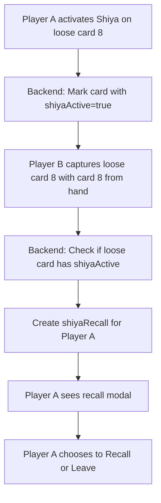

# Shiya Activation on Loose Cards - Technical Implementation Plan

## Overview

Extend Shiya activation system to support loose cards (single cards on the table). When a player activates Shiya on a loose card (e.g., an 8), and another player captures that loose card with a matching card from their hand, the Shiya recall effect should trigger for the player who activated Shiya.

---

## Current System Analysis

### Backend - Shiya Support

| Stack Type | Shiya Activation | Recall on Capture |
|------------|------------------|-------------------|
| Build Stack | ✅ Supported | ✅ Supported (captureOwn.js) |
| Temp Stack | ✅ Supported | ✅ Supported (dropToCapture.js) |
| Loose Card | ❌ NOT Supported | ❌ NOT Supported |

### Current Implementation

1. **[`shiya.js`](shared/game/actions/shiya.js:26-29)**: Only supports `build_stack` and `temp_stack`
   ```javascript
   const tableCard = state.tableCards.find(
     tc => tc.stackId === stackId && (tc.type === 'build_stack' || tc.type === 'temp_stack')
   );
   ```

2. **[`capture.js`](shared/game/actions/capture.js)**: Handles loose card capture but no Shiya recall
3. **[`captureOwn.js`](shared/game/actions/captureOwn.js:92-123)**: Has Shiya recall for builds, but not for loose cards

---

## Architecture



---

## Data Model Changes

### Loose Card with Shiya (Simplified - No Owner Tracking)

Currently loose cards are stored in `tableCards` without a `type` property:
```javascript
{ rank: '8', suit: '♥', value: 8 }  // Loose card
{ type: 'build_stack', stackId: '...', ... }  // Build
{ type: 'temp_stack', stackId: '...', ... }  // Temp stack
```

**Simplified Approach**: Any teammate's loose card can be Shiya-activated. No owner tracking needed.

Add Shiya tracking to loose cards:
```javascript
{ 
  rank: '8', 
  suit: '♥', 
  value: 8,
  shiyaActive: true,
  shiyaPlayer: 0  // Player index who activated Shiya
}
```

---

## Implementation Steps

### Step 1: Create New shiyaLooseCard Action

**File**: `shared/game/actions/shiyaLooseCard.js` (new file)

Create a dedicated action for loose card Shiya activation (simpler than modifying existing shiya.js):

```javascript
/**
 * shiyaLooseCard
 * Activate Shiya on a loose card (single card on table).
 * Party mode only - allows a player to claim teammate's loose card.
 * Simplified: Any teammate's loose card can be Shiya'd (no owner needed).
 * 
 * Payload: { rank: string, suit: string }
 */

const { areTeammates } = require('../team');

function shiyaLooseCard(state, payload, playerIndex) {
  const { rank, suit } = payload;
  
  console.log(`[shiyaLooseCard] Called: playerIndex=${playerIndex}, rank=${rank}, suit=${suit}`);
  
  // Validate party mode
  if (state.playerCount !== 4) {
    throw new Error('Shiya is only available in party mode (4 players)');
  }
  
  // Find the loose card on the table (no type, just rank/suit)
  const tableIdx = state.tableCards.findIndex(
    tc => !tc.type && tc.rank === rank && tc.suit === suit
  );
  
  if (tableIdx === -1) {
    throw new Error(`Loose card ${rank}${suit} not found on table`);
  }
  
  const tableCard = state.tableCards[tableIdx];
  
  // Validate card doesn't already have Shiya active
  if (tableCard.shiyaActive) {
    throw new Error('Shiya is already active on this loose card');
  }
  
  // Validate player has a matching card in hand (same rank)
  const playerHand = state.players[playerIndex]?.hand || [];
  const hasMatchingCard = playerHand.some(card => card.rank === rank);
  
  if (!hasMatchingCard) {
    throw new Error(`You need a ${rank} to use Shiya on this loose card`);
  }
  
  // Create new state with Shiya activated
  const newState = JSON.parse(JSON.stringify(state));
  
  // Mark Shiya as active on the loose card
  newState.tableCards[tableIdx].shiyaActive = true;
  newState.tableCards[tableIdx].shiyaPlayer = playerIndex;
  
  console.log(`[shiyaLooseCard] Player ${playerIndex} activated Shiya on loose card ${rank}${suit}`);
  
  return newState;
}

module.exports = shiyaLooseCard;
```

### Step 2: Modify capture.js to Add Shiya Recall for Loose Cards

**File**: `shared/game/actions/capture.js`

After capturing a loose card (around line 59), add:
```javascript
// === SHIYA RECALL CHECK FOR LOOSE CARD ===
// Only trigger recall when a TEEMMATE of the Shiya activator captures the card
// (Same logic as builds - only the owner capturing their own card triggers recall)
if (targetCard.shiyaActive && targetCard.shiyaPlayer !== undefined) {
  const activator = targetCard.shiyaPlayer;
  
  // Check if capturer is a teammate of the Shiya activator
  // (Just like builds - only teammate capturing their own card triggers recall)
  const isTeammateCapture = areTeammates(playerIndex, activator);
  
  if (isTeammateCapture) {
    console.log(`[capture] ✅ Shiya active on loose card! Teammate captured - creating recall for player ${activator}`);
    
    // Ensure shiyaRecalls exists
    if (!newState.shiyaRecalls) {
      newState.shiyaRecalls = {};
    }
    
    // Use card rank/suit as key for loose card recalls
    const cardKey = `${targetRank}${targetSuit}`;
    
    if (!newState.shiyaRecalls[activator]) {
      newState.shiyaRecalls[activator] = {};
    }
    
    // Store recall info for loose card
    newState.shiyaRecalls[activator][cardKey] = {
      cardKey: cardKey,
      rank: targetRank,
      suit: targetSuit,
      value: targetCard.value,
      capturedBy: playerIndex,
      buildCards: [targetCard],  // The captured loose card
      captureCards: [capturingCard],  // The card used to capture
      expiresAt: Date.now() + 4000,
      isLooseCard: true,  // Flag for loose card recall
    };
  } else {
    console.log(`[capture] Shiya active but opponent captured - no recall triggered`);
  }
}
```

### Step 3: Modify captureOwn.js for Loose Card Shiya Recall

**File**: `shared/game/actions/captureOwn.js`

Similar to capture.js, add Shiya recall after loose card capture (around line 58).

Note: `captureOwn.js` is used when a player captures their OWN loose card/build. Since this is the owner capturing their own card, we need to check:
- Is Shiya active on this card?
- Is the owner a teammate of the Shiya activator?

If YES (owner is teammate of activator), trigger recall for the activator.

### Step 4: Modify Frontend to Support Loose Card Shiya Selection

**File**: `components/game/GameBoard.tsx`

Add a new handler for loose card taps (simplified - no owner check):

```typescript
// Handle loose card tap for Shiya selection
const handleLooseCardTap = useCallback((card: any) => {
  console.log('[handleLooseCardTap] Tapped card:', card?.rank, card?.suit);
  
  // Check if party mode (required for Shiya)
  if (!card || gameState.playerCount !== 4) {
    setSelectedBuildForShiya(null);
    return;
  }
  
  // Check if Shiya is already active on this card
  if (card.shiyaActive) {
    console.log('[handleLooseCardTap] Shiya already active');
    setSelectedBuildForShiya(null);
    return;
  }
  
  // Check if we have a matching card (same rank) - any teammate's card can be Shiya'd
  const myHand = gameState.players?.[playerNumber]?.hand ?? [];
  const hasMatch = myHand.some((c: any) => c.rank === card.rank);
  
  if (hasMatch) {
    // Eligible for Shiya - set selected (reusing selectedBuildForShiya state)
    console.log('[handleLooseCardTap] Setting selected card for Shiya');
    setSelectedBuildForShiya({
      ...card,
      isLooseCard: true,  // Flag for loose card
    });
    
    // Auto-hide Shiya button after 5 seconds
    if (shiyaButtonTimerRef.current) clearTimeout(shiyaButtonTimerRef.current);
    shiyaButtonTimerRef.current = setTimeout(() => {
      setSelectedBuildForShiya(null);
      shiyaButtonTimerRef.current = null;
    }, 5000);
  } else {
    console.log('[handleLooseCardTap] No matching card in hand');
    setSelectedBuildForShiya(null);
  }
}, [gameState, playerNumber]);
```

### Step 5: Wire Up Loose Card Tap Handler

**File**: `components/game/GameBoard.tsx`

Pass `handleLooseCardTap` to `TableArea`:
```tsx
<TableArea
  // ... existing props
  onLooseCardTap={handleLooseCardTap}
/>
```

**File**: `components/table/TableArea.tsx`

Add `onLooseCardTap` prop and wire to card press handlers.

### Step 6: Modify Shiya Button Action for Loose Cards

**File**: `components/game/GameBoard.tsx`

Update the `onShiya` callback to handle loose cards:
```typescript
onShiya={(stackId) => {
  // Clear the Shiya button immediately when clicked
  if (shiyaButtonTimerRef.current) {
    clearTimeout(shiyaButtonTimerRef.current);
    shiyaButtonTimerRef.current = null;
  }
  
  const selected = selectedBuildForShiya;
  setSelectedBuildForShiya(null);
  
  if (selected?.isLooseCard) {
    // Loose card Shiya activation
    actions.shiyaLooseCard(selected.rank, selected.suit);
  } else {
    // Build/Temp stack Shiya activation (existing)
    actions.shiya(stackId);
  }
}}
```

---

## Files to Modify

| # | File | Change Type | Description |
|---|------|-------------|-------------|
| 1 | `shared/game/actions/shiyaLooseCard.js` | New | New action for loose card Shiya activation |
| 2 | `shared/game/actions/capture.js` | Modify | Add Shiya recall for loose cards |
| 3 | `shared/game/actions/captureOwn.js` | Modify | Add Shiya recall for loose cards |
| 4 | `components/game/GameBoard.tsx` | Modify | Add handleLooseCardTap, wire to TableArea |
| 5 | `components/table/TableArea.tsx` | Modify | Add onLooseCardTap prop |
| 6 | `shared/game/index.js` | Modify | Export shiyaLooseCard |

---

## Testing Checklist

- [ ] **Party Mode**: Activate 4-player party mode
- [ ] **Loose Card on Table**: Have any loose card on the table
- [ ] **Tap Loose Card**: Tap the loose card - Shiya button should appear (if you have matching rank)
- [ ] **Activate Shiya**: Click Shiya button, verify `shiyaActive: true` on card
- [ ] **Teammate Captures**: Teammate captures the loose card with matching card → Recall modal triggers
- [ ] **Opponent Captures**: Opponent captures the loose card → NO recall triggered (same as builds)
- [ ] **Recall Modal**: Shiya activator sees recall modal with 4-second timer
- [ ] **Recall Action**: Clicking "Recall" takes the card
- [ ] **No Match**: Tapping loose card without matching rank shows nothing
- [ ] **Already Active**: Tapping card with Shiya already active shows nothing

---

## Edge Cases

1. **Multiple loose cards of same rank**: Each can have independent Shiya
2. **Card already captured**: Shiya activation fails gracefully
3. **Any loose card**: Simplified approach allows Shiya on any loose card (no owner check)
4. **Card with Shiya already**: No second activation allowed
