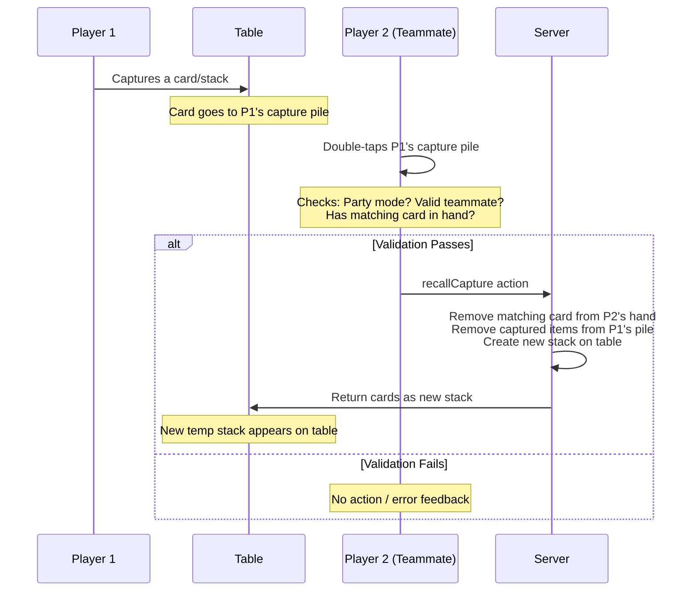

# Shiya Post-Capture Recall Implementation Plan

## Overview

This plan outlines implementing Shiya as a **post-capture recall feature** - a simpler approach where teammates can double-tap on a capture pile to recall captured items, rather than pre-activating Shiya on stacks/cards.

### Key Benefits

1. **Simpler frontend** - No Shiya button to show/hide on stacks
2. **Unified logic** - Works for builds, temp stacks, and loose cards without special-case handling
3. **Lax validation** - No need to know the temp stack's value at creation; validation happens only when a teammate tries to recall
4. **Reduced state** - No `shiyaActive` flag to maintain on stacks/cards
5. **Consistent UX** - Recall is always a manual, intentional action by the teammate

---

## How It Works



---

## Implementation Steps

### Phase 1: Backend Changes

#### 1.1 Create `recallCapture` Action

**File:** `shared/game/actions/recallCapture.js`

Create a new action that handles recalling captured items:

```javascript
function recallCapture(state, payload, playerIndex) {
  const { targetPlayerIndex, capturedItemIndex } = payload;
  
  // Validation:
  // 1. Must be party mode (4 players)
  // 2. Target player must be a teammate
  // 3. Player must have a matching card in hand
  // 4. Captured item must exist
  
  // Actions:
  // 1. Remove matching card from player's hand
  // 2. Remove captured items from target player's pile
  // 3. Create new temp stack on table with both cards
}
```

**Key validation logic:**
- Check party mode (`state.playerCount === 4`)
- Check teammate status using `areTeammates(playerIndex, targetPlayerIndex)`
- Check player has matching card in hand (same value as captured item)
- For captured stacks: match against stack value
- For captured loose cards: match against card rank/value

#### 1.2 Update Action Exports

**File:** `shared/game/actions/index.js`

Add the new action export:

```javascript
recallCapture: require('./recallCapture'),
```

---

### Phase 2: Frontend Hook Changes

#### 2.1 Add `recallCapture` Callback

**File:** `hooks/game/useGameActions.ts`

Add the new callback:

```typescript
const recallCapture = useCallback((targetPlayerIndex: number, capturedItemIndex: number) => {
  sendAction({
    type: 'recallCapture',
    payload: { targetPlayerIndex, capturedItemIndex }
  });
}, [sendAction]);

// Export in return object
return {
  // ...existing exports
  recallCapture,
};
```

---

### Phase 3: Capture Pile UI Changes

#### 3.1 Add Double-Tap Handler to CapturePile

**File:** `components/table/CapturePile.tsx`

Add new props and handlers:

```typescript
interface CapturePileProps {
  // ...existing props
  
  /** Callback for double-tap to recall captured items (Shiya) */
  onRecallAttempt?: (targetPlayerIndex: number) => void;
}
```

Add double-tap detection using a timer:

```typescript
const lastTapRef = useRef<number>(0);

const handlePress = useCallback(() => {
  const now = Date.now();
  const DOUBLE_TAP_DELAY = 300; // ms
  
  if (now - lastTapRef.current < DOUBLE_TAP_DELAY) {
    // Double tap detected
    if (onRecallAttempt) {
      onRecallAttempt(playerIndex);
    }
  }
  lastTapRef.current = now;
}, [playerIndex, onRecallAttempt]);
```

Wrap the pile in a TouchableOpacity to capture taps:

```tsx
<TouchableOpacity 
  onPress={handlePress}
  // ... styles
>
  {/* Existing pile content */}
</TouchableOpacity>
```

#### 3.2 Add Props to CapturedCardsView

**File:** `components/table/CapturedCardsView.tsx`

Add the callback prop and pass it to CapturePile:

```typescript
interface CapturedCardsViewProps {
  // ...existing props
  
  /** Callback when player attempts to recall from a capture pile */
  onRecallAttempt?: (targetPlayerIndex: number) => void;
}

// In renderPile function:
<CapturePile
  // ...existing props
  onRecallAttempt={onRecallAttempt}
/>
```

#### 3.3 Add Props to TableArea

**File:** `components/table/TableArea.tsx`

Add the callback prop:

```typescript
interface Props {
  // ...existing props
  
  /** Callback when player attempts to recall from a capture pile */
  onRecallAttempt?: (targetPlayerIndex: number) => void;
}

// Pass to CapturedCardsView
<CapturedCardsView
  // ...existing props
  onRecallAttempt={onRecallAttempt}
/>
```

---

### Phase 4: GameBoard Integration

#### 4.1 Add Handler in GameBoard

**File:** `components/game/GameBoard.tsx`

Add the handler function:

```typescript
const handleRecallAttempt = useCallback((targetPlayerIndex: number) => {
  console.log('[handleRecallAttempt] Target player:', targetPlayerIndex);
  
  // Check party mode
  if (gameState.playerCount !== 4) {
    console.log('[handleRecallAttempt] Not party mode');
    return;
  }
  
  // Check if target is a teammate
  if (!areTeammates(playerNumber, targetPlayerIndex)) {
    console.log('[handleRecallAttempt] Not a teammate');
    return;
  }
  
  // Check if player has any matching cards in hand
  // For simplicity, show the modal first and validate on server
  // This allows showing what can be recalled
  
  // TODO: Determine which captured item to recall
  // For MVP: Just pass the target player index and let server 
  // determine what can be recalled based on hand
  
  actions.recallCapture(targetPlayerIndex, 0); // Index 0 = most recent
}, [gameState, playerNumber, actions]);
```

Pass handler to TableArea:

```tsx
<TableArea
  // ...existing props
  onRecallAttempt={handleRecallAttempt}
/>
```

---

### Phase 5: Validation & Display Logic

#### 5.1 Server-Side Validation Enhancement

The server should validate and return what can be recalled. Create a more sophisticated validation:

**In `recallCapture.js`:**

```javascript
// Find all recallable items from target player's pile
// that match a card in the requesting player's hand

const getRecallableItems = (targetCaptures, playerHand) => {
  const recallable = [];
  
  for (let i = 0; i < targetCaptures.length; i++) {
    const captured = targetCaptures[i];
    // Check if any card in hand matches
    const hasMatch = playerHand.some(card => 
      card.value === captured.value || card.rank === captured.rank
    );
    if (hasMatch) {
      recallable.push({ index: i, card: captured });
    }
  }
  
  return recallable;
};
```

#### 5.2 Show Recall Options Modal

For a better UX, instead of immediately executing, show a modal that lets the player choose which captured item to recall.

**Option A:** Extend existing ShiyaRecallModal (current implementation)
- Reuse the modal to show recallable items
- Let player choose which to recall

**Option B:** Create a new "Select Recall" modal
- Shows all recallable items from teammate's pile
- Player selects which to recall with matching card

---

## Alternative: Immediate Execution with Feedback

For a simpler MVP, implement immediate execution with error feedback:

1. Double-tap capture pile
2. Client validates: party mode + teammate + has matching card
3. Send `recallCapture` action
4. Server validates again + executes
5. If error: show toast/feedback
6. If success: cards return to table as new stack

---

## Data Structures

### Capture Pile Item

```typescript
interface CapturedItem {
  rank: string;
  suit: string;
  value: number;
  // For stacks: could be multiple cards
  cards?: Card[];
}
```

### Recall Action Payload

```typescript
interface RecallCapturePayload {
  targetPlayerIndex: number;  // Whose pile to recall from
  capturedItemIndex: number;   // Which item in that pile (0 = most recent)
}
```

---

## Edge Cases

1. **Empty capture pile** - Double-tap does nothing
2. **No matching card** - Show feedback "No matching card in hand"
3. **Not a teammate** - Double-tap on opponent pile does nothing
4. **Non-party mode** - Double-tap disabled
5. **Multiple recallable items** - For MVP, recall most recent; later versions can show selection
6. **Stack already has a value** - When creating new temp stack from recalled cards, need to determine value

---

## Testing Checklist

- [ ] Party mode (4 players) required for recall
- [ ] Can only recall from teammate's pile, not opponent's
- [ ] Must have matching card (same value/rank) in hand
- [ ] Successful recall removes matching card from hand
- [ ] Successful recall removes captured items from teammate's pile
- [ ] New temp stack created on table with both cards
- [ ] Non-party mode: double-tap does nothing
- [ ] Opponent pile: double-tap does nothing

---

## Files to Modify

### Backend (New)
- `shared/game/actions/recallCapture.js` - NEW FILE

### Backend (Modify)
- `shared/game/actions/index.js` - Add export

### Frontend Hooks (Modify)
- `hooks/game/useGameActions.ts` - Add recallCapture callback

### Frontend Components (Modify)
- `components/table/CapturePile.tsx` - Add double-tap handler
- `components/table/CapturedCardsView.tsx` - Pass callback
- `components/table/TableArea.tsx` - Pass callback
- `components/game/GameBoard.tsx` - Add handler and wire up

---

## Implementation Effort

| Phase | Files | Complexity |
|-------|-------|------------|
| Backend | 2 | Medium |
| Hooks | 1 | Low |
| Frontend | 4 | Medium |
| **Total** | **7** | - |

---

## Next Steps

1. Start with Phase 1 - Backend action
2. Phase 2 - Frontend hooks
3. Phase 3-4 - UI integration
4. Phase 5 - Validation refinement
