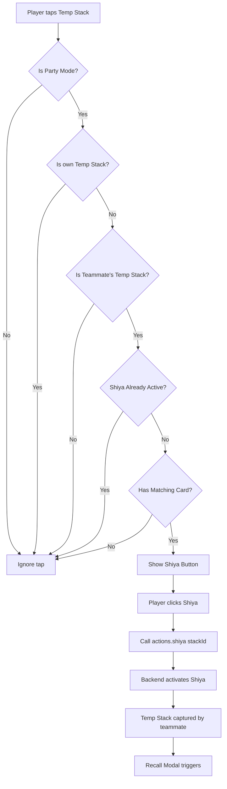

# Shiya Activation on Temp Stacks - Technical Implementation Plan

## Executive Summary

The Shiya activation system currently supports Builds but not Temp Stacks. After analyzing the codebase, I found that:
- **Backend**: Already supports Shiya on Temp Stacks (no changes needed)
- **Recall Modal**: Already triggers for Temp Stacks (no changes needed)
- **Frontend**: Only handles Shiya selection for Build Stacks (NEEDS MODIFICATION)

This plan focuses on enabling the frontend to allow Shiya activation on Temp Stacks.

---

## Current System Analysis

### Backend (Already Complete ✓)

| File | Status | Notes |
|------|--------|-------|
| `shared/game/actions/shiya.js` | ✓ Complete | Lines 26-29, 62-64 already support `build_stack` AND `temp_stack` |
| `shared/game/actions/dropToCapture.js` | ✓ Complete | Lines 177-210 already create recall offers for temp stacks |
| `shared/game/actions/captureTemp.js` | ✓ Complete | Has Shiya recall logic |

### Frontend (Needs Modification ✗)

| File | Issue |
|------|-------|
| `components/game/GameBoard.tsx` | `handleBuildTap` (lines 251-311) only handles Shiya for Build Stacks - temp stacks return early without Shiya check |

---

## Architecture



---

## Implementation Steps

### Step 1: Modify `handleBuildTap` in GameBoard.tsx

**File**: `components/game/GameBoard.tsx`

**Current Logic (lines 251-260)**:
```typescript
const handleBuildTap = useCallback((stack: any) => {
  // Check if this is a temp stack (dual builds feature)
  if (stack.type === 'temp_stack') {
    // For temp stacks, show confirmation modal on double-click
    modals.openConfirmTempBuildModal(stack);
    return;  // <-- PROBLEM: Returns early without Shiya check
  }
  // ... rest of Shiya logic for builds
}, ...);
```

**Required Changes**:
1. Remove the early return for temp stacks
2. Add temp stack handling WITHIN the Shiya selection logic (after the party mode check)
3. Check if temp stack belongs to teammate (not own)
4. Check if player has matching card (matching `stack.value`)
5. Check if Shiya not already active
6. Show Shiya button for eligible temp stacks

**New Logic Flow**:
```typescript
const handleBuildTap = useCallback((stack: any) => {
  // Process ALL stack types for Shiya eligibility (party mode only)
  if (gameState.playerCount !== 4) {
    // Not party mode - only handle confirm modal for temp stacks
    if (stack.type === 'temp_stack') {
      modals.openConfirmTempBuildModal(stack);
    }
    setSelectedBuildForShiya(null);
    return;
  }
  
  // === SHIYA ELIGIBILITY CHECK (for BOTH build_stack and temp_stack) ===
  
  // Skip Shiya if: own stack, not teammate, or Shiya already active
  if (stack.owner === playerNumber) {
    setSelectedBuildForShiya(null);
    return;
  }
  
  const isTeammate = areTeammates(playerNumber, stack.owner);
  if (!isTeammate) {
    setSelectedBuildForShiya(null);
    return;
  }
  
  if (stack.shiyaActive) {
    setSelectedBuildForShiya(null);
    return;
  }
  
  // Check if we have a matching card
  const myHand = gameState.players?.[playerNumber]?.hand ?? [];
  const hasMatch = myHand.some((card: any) => card.value === stack.value);
  
  if (hasMatch) {
    // Eligible for Shiya - set selected for Shiya button
    setSelectedBuildForShiya(stack);
    
    // Auto-hide Shiya button after 5 seconds
    if (shiyaButtonTimerRef.current) clearTimeout(shiyaButtonTimerRef.current);
    shiyaButtonTimerRef.current = setTimeout(() => {
      setSelectedBuildForShiya(null);
      shiyaButtonTimerRef.current = null;
    }, 5000);
  } else {
    setSelectedBuildForShiya(null);
  }
  
  // === DUAL BUILDS: Show confirm modal for OWN temp stacks ===
  // Only if not eligible for Shiya
  if (stack.type === 'temp_stack' && !hasMatch) {
    modals.openConfirmTempBuildModal(stack);
  }
}, [gameState, playerNumber, modals]);
```

### Step 2: Pass `onBuildTap` to TempStackView (if not already)

**File**: `components/table/TempStackView.tsx`

Ensure the `onBuildTap` callback is properly wired to the temp stack tap handler.

**Current**: `TempStackItem.tsx` already passes `onBuildTap` to `TempStackView`

### Step 3: Verify Recall Modal Works for Temp Stacks

**File**: `components/modals/ShiyaRecallModal.tsx`

**Status**: Already compatible - the modal receives `build` prop which includes:
- `stackId`
- `value`
- `buildCards` (array of cards)
- `capturedBy`
- `originalOwner`

The existing modal rendering logic works for both builds and temp stacks since it uses generic `build.cards` and `build.value`.

---

## Files to Modify

| # | File | Change Type | Description |
|---|------|-------------|-------------|
| 1 | `components/game/GameBoard.tsx` | Modify | Update `handleBuildTap` to handle temp stacks for Shiya |

---

## Testing Checklist

- [ ] **Party Mode**: Activate 4-player party mode
- [ ] **Create Temp Stack**: Player A creates temp stack (e.g., 5+2=7)
- [ ] **Teammate Tap**: Player B (teammate) taps the temp stack
- [ ] **Shiya Button**: Shiya button appears (if Player B has a 7)
- [ ] **No Match**: If Player B has no 7, confirm modal appears instead
- [ ] **Own Temp Stack**: Tapping own temp stack shows confirm modal (no Shiya)
- [ ] **Activate Shiya**: Click Shiya button, verify `shiyaActive: true` on stack
- [ ] **Capture Temp Stack**: Player A captures their own temp stack (with Shiya)
- [ ] **Recall Modal**: Player B sees recall modal with 4-second timer
- [ ] **Recall Action**: Clicking "Recall" returns cards to table as new stack

---

## Edge Cases to Consider

1. **Temp Stack with multiple cards**: Uses `stack.value` (e.g., 7) for matching - same as builds
2. **Temp Stack owned by opponent**: No Shiya option (must be teammate's)
3. **Temp Stack already has Shiya**: No second activation allowed
4. **Multiple temp stacks**: Each can have independent Shiya activation
5. **Mixed builds