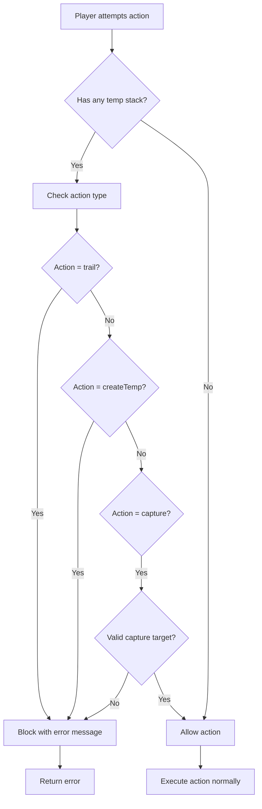

# Temp Stack Guardrails Implementation Plan

## Overview
This plan outlines implementation of game logic guardrails to prevent players from performing certain actions when any player has an active temp stack on the table.

## Requirements
1. When any player has an active temp stack on the table:
   - No player should be allowed to TRAIL a card
   - No player should be allowed to CREATE another temp stack
   - The only card that can be captured is the active temp stack itself (not other cards on table)
   - Specifically: if player has temp stack 7, they cannot capture temp stack 10 - can only capture temp stack 7 (their own)

2. Work correctly for varying player counts (2, 3, 4 players)

3. Integrate properly with existing cancelTemp functionality

---

## Implementation Strategy

### Phase 1: Create Helper Function

Create a shared helper function in `shared/game/tempStackHelpers.js` that provides:

```javascript
/**
 * Get all active temp stacks on the table
 * @param {object} state - Game state
 * @returns {Array} - Array of temp stack objects
 */
function getActiveTempStacks(state)

/**
 * Check if ANY player has an active temp stack on the table
 * @param {object} state - Game state
 * @returns {boolean}
 */
function hasAnyActiveTempStack(state)

/**
 * Get the active temp stack owned by a specific player
 * @param {object} state - Game state
 * @param {number} playerIndex - Player index
 * @returns {object|null} - Temp stack object or null
 */
function getPlayerTempStack(state, playerIndex)
```

### Phase 2: Implement Guardrails in Actions

#### 2.1 trail.js
Add validation at the start of the function:

```javascript
// GUARDRAIL: Prevent trail when any player has active temp stack
if (hasAnyActiveTempStack(state)) {
  throw new Error('Cannot trail - there is an active temp stack on the table. Capture or cancel it first.');
}
```

#### 2.2 createTemp.js
Add validation at the start of the function:

```javascript
// GUARDRAIL: Prevent create temp when any player has active temp stack
if (hasAnyActiveTempStack(state)) {
  throw new Error('Cannot create temp stack - there is already an active temp stack on the table. Capture or cancel it first.');
}
```

#### 2.3 capture.js
Add validation for build-type captures:

```javascript
// GUARDRAIL: When capturing a build, verify it's the player's own temp stack
if (targetType === 'build') {
  const buildStack = newState.tableCards.find(tc => tc.stackId === targetStackId);
  if (buildStack && buildStack.type === 'temp_stack') {
    // Player can only capture their own temp stack
    const playerTempStack = getPlayerTempStack(state, playerIndex);
    if (playerTempStack && playerTempStack.stackId !== targetStackId) {
      throw new Error('Cannot capture another player\'s temp stack - can only capture your own');
    }
  }
  
  // GUARDRAIL: Prevent capture of any build when other temp stacks exist
  const anyTempStack = hasAnyActiveTempStack(state);
  if (anyTempStack && buildStack?.type !== 'temp_stack') {
    throw new Error('Cannot capture builds when there is an active temp stack on the table');
  }
}
```

#### 2.4 captureOwn.js
Add validation for build-type captures:

```javascript
// GUARDRAIL: When capturing a build, verify it's the player's own temp stack
if (targetType === 'build') {
  const buildStack = newState.tableCards.find(tc => tc.stackId === targetStackId);
  if (buildStack && buildStack.type === 'temp_stack') {
    // Player can only capture their own temp stack
    const playerTempStack = getPlayerTempStack(state, playerIndex);
    if (playerTempStack && playerTempStack.stackId !== targetStackId) {
      throw new Error('Cannot capture another player\'s temp stack - can only capture your own');
    }
  }
  
  // GUARDRAIL: Prevent capture of regular build when temp stack exists
  const playerTempStack = getPlayerTempStack(state, playerIndex);
  if (playerTempStack && buildStack?.type !== 'temp_stack') {
    throw new Error('Cannot capture other cards when you have an active temp stack - capture your temp stack first');
  }
}
```

#### 2.5 captureOpponent.js
Add validation:

```javascript
// GUARDRAIL: Prevent capture opponent when player has active temp stack
const playerTempStack = getPlayerTempStack(state, playerIndex);
if (playerTempStack) {
  throw new Error('Cannot capture opponent\'s build when you have an active temp stack - capture your temp stack first');
}

// Also check for ANY temp stack on table
if (hasAnyActiveTempStack(state)) {
  throw new Error('Cannot capture opponent\'s build when there is an active temp stack on the table');
}
```

**NOTE: addToTemp.js does NOT need modification** - The existing code already validates that only the temp stack owner can add cards to their own temp stack (line 71 checks `if (stack.owner !== playerIndex)`)

---

## Files to Modify

| File | Modification |
|------|--------------|
| `shared/game/tempStackHelpers.js` | Create new helper file |
| `shared/game/actions/trail.js` | Add guardrail validation |
| `shared/game/actions/createTemp.js` | Add guardrail validation |
| `shared/game/actions/capture.js` | Add guardrail validation for build captures |
| `shared/game/actions/captureOwn.js` | Add guardrail validation for build captures |
| `shared/game/actions/captureOpponent.js` | Add guardrail validation |

**Note:** `addToTemp.js` does NOT require modification - the existing code already validates that only the temp stack owner can add cards (line 71 already checks `if (stack.owner !== playerIndex)`).

---

## Integration with cancelTemp

The `cancelTemp` action (already implemented in `shared/game/actions/cancelTemp.js`) properly removes temp stacks from the table. The guardrails will automatically allow actions once `cancelTemp` is called because:

1. After `cancelTemp` executes, the temp stack is removed from `state.tableCards`
2. `hasAnyActiveTempStack(state)` will return `false`
3. All guardrail validations will pass

This creates the correct game flow:
```
Player creates temp stack → Other players blocked from trail/createTemp/capture → 
Player captures/accepts/cancels their temp stack → Game continues normally
```

---

## Error Messages Summary

| Action | Error Message |
|--------|---------------|
| trail | `Cannot trail - there is an active temp stack on the table. Capture or cancel it first.` |
| createTemp | `Cannot create temp stack - there is already an active temp stack on the table. Capture or cancel it first.` |
| capture (build) | `Cannot capture another player\'s temp stack - can only capture your own` |
| capture (build) | `Cannot capture builds when there is an active temp stack on the table` |
| captureOwn (build) | `Cannot capture another player\'s temp stack - can only capture your own` |
| captureOwn (build) | `Cannot capture other cards when you have an active temp stack - capture your temp stack first` |
| captureOpponent | `Cannot capture opponent\'s build when you have an active temp stack - capture your temp stack first` |
| captureOpponent | `Cannot capture opponent\'s build when there is an active temp stack on the table` |

---

## Testing Considerations

1. **2-Player Game**: One player creates temp stack → other player blocked from all restricted actions
2. **3-Player Game**: Player 0 creates temp stack → Player 1 AND Player 2 blocked
3. **4-Player Game**: Player 2 creates temp stack → All other players blocked (including teammate)
4. **After cancelTemp**: Verify all actions work normally after temp is cancelled
5. **After acceptTemp**: Verify temp stack converted to build_stack allows normal play
6. **After captureTemp**: Verify capturing own temp stack allows normal play

---

## Implementation Flow



This plan provides a comprehensive approach to implementing the temp stack guardrails while maintaining compatibility with existing cancelTemp functionality.