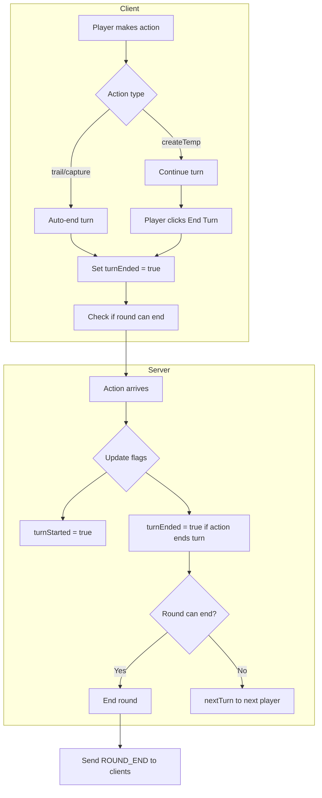

# Turn Tracking Flags Implementation Plan

## Overview

This plan implements per-player turn tracking flags (`turnStarted` and `turnEnded`) to ensure robust round-end detection and prevent Round 1 from ending prematurely.

## Current Game Behavior Analysis

### Turn Auto-End Actions (immediately advance turn)
- [`trail.js`](shared/game/actions/trail.js) - Calls `nextTurn()` at end
- [`capture.js`](shared/game/actions/capture.js) - Calls `nextTurn()` at end
- `captureOwn.js`, `captureOpponent.js` - Likely also auto-end

### Multi-Action Turn (does NOT auto-end)
- [`createTemp.js`](shared/game/actions/createTemp.js) - Does NOT call `nextTurn()`, allows multiple actions before explicit end
- Build extensions (`addToTemp.js`, `addToBuild.js`, etc.) - Same pattern

### Explicit End Turn
- [`endTurn.js`](shared/game/actions/endTurn.js) - Currently just advances to next player

---

## Architecture



---

## Implementation Steps

### Step 1: Update TypeScript Types

**File: [`types/game.types.ts`](types/game.types.ts)**

Add `RoundPlayerState` interface and update `GameState`:

```typescript
export interface RoundPlayerState {
  playerId: number;
  turnStarted: boolean;
  turnEnded: boolean;
  actionTriggered: boolean;
  actionCompleted: boolean;
  // lastAction?: ActionType;
}

export interface GameState {
  // ... existing fields
  players: Player[];
  table: TableItem[];
  currentPlayer: number;
  phase: 'play' | 'build' | 'scoring';
  round: number;
  teamScores: [number, number];
  playerCount: number;
  
  // NEW: Turn tracking per round
  roundPlayers: Record<number, RoundPlayerState>; // keyed by player index
}
```

### Step 2: Update GameState.js (Shared)

**File: [`shared/game/GameState.js`](shared/game/GameState.js)**

Update `initializeGame()` and `initializeTestGame()` to include turn tracking:

```javascript
function initializeGame(playerCount = 2) {
  // ... existing setup ...
  
  // NEW: Initialize turn tracking for each player
  const roundPlayers = {};
  for (let i = 0; i < playerCount; i++) {
    roundPlayers[i] = {
      playerId: i,
      turnStarted: false,
      turnEnded: false,
      actionTriggered: false,
      actionCompleted: false,
    };
  }
  
  return {
    // ... existing fields
    roundPlayers,
    currentPlayer: 0, // First player starts
  };
}
```

Add helper functions:

```javascript
/**
 * Mark a player's turn as started
 */
function startPlayerTurn(state, playerIndex) {
  if (!state.roundPlayers[playerIndex]) {
    state.roundPlayers[playerIndex] = {
      playerId: playerIndex,
      turnStarted: false,
      turnEnded: false,
      actionTriggered: false,
      actionCompleted: false,
    };
  }
  state.roundPlayers[playerIndex].turnStarted = true;
  return state;
}

/**
 * Mark a player's turn as ended
 */
function endPlayerTurn(state, playerIndex) {
  if (state.roundPlayers[playerIndex]) {
    state.roundPlayers[playerIndex].turnEnded = true;
  }
  return state;
}

/**
 * Reset all turn flags for a new round
 */
function resetRoundPlayers(state) {
  const playerCount = state.playerCount || state.players.length;
  state.roundPlayers = {};
  for (let i = 0; i < playerCount; i++) {
    state.roundPlayers[i] = {
      playerId: i,
      turnStarted: false,
      turnEnded: false,
      actionTriggered: false,
      actionCompleted: false,
    };
  }
  return state;
}
```

### Step 3: Create Turn Manager Utility

**New File: [`shared/game/utils/turnManager.js`](shared/game/utils/turnManager.js)**

```javascript
const { cloneState, startPlayerTurn, endPlayerTurn, nextTurn } = require('../GameState');

/**
 * Handle the start of a player's turn
 */
function handleTurnStart(state, playerIndex) {
  const newState = cloneState(state);
  startPlayerTurn(newState, playerIndex);
  console.log(`[turnManager] Player ${playerIndex} turn started`);
  return newState;
}

/**
 * Handle an action that ends the turn (like trail, capture)
 * Sets all action flags and moves to next player
 */
function handleActionEndsTurn(state, playerIndex) {
  const newState = cloneState(state);
  
  // Mark action as triggered and completed
  if (newState.roundPlayers[playerIndex]) {
    newState.roundPlayers[playerIndex].actionTriggered = true;
    newState.roundPlayers[playerIndex].actionCompleted = true;
    newState.roundPlayers[playerIndex].turnEnded = true;
  }
  
  // Advance to next player
  return nextTurn(newState);
}

/**
 * Handle explicit end turn (for multi-action turns like createTemp)
 */
function handleExplicitEndTurn(state, playerIndex) {
  const newState = cloneState(state);
  
  // Mark turn as ended
  if (newState.roundPlayers[playerIndex]) {
    newState.roundPlayers[playerIndex].turnEnded = true;
  }
  
  // Check if round can end before moving to next player
  // (handled by RoundValidator)
  
  // Advance to next player
  return nextTurn(newState);
}

/**
 * Check if all active players have ended their turn
 */
function allPlayersTurnEnded(state) {
  const players = state.roundPlayers || {};
  const playerIds = Object.keys(players);
  
  if (playerIds.length === 0) return false;
  
  return playerIds.every(id => players[id].turnEnded === true);
}

/**
 * Force end turn for a player who hasn't acted
 * Used for Round 1 validation or disconnection handling
 */
function forceEndTurn(state, playerIndex) {
  const newState = cloneState(state);
  
  if (!newState.roundPlayers[playerIndex]) {
    newState.roundPlayers[playerIndex] = {
      playerId: playerIndex,
      turnStarted: false,
      turnEnded: false,
      actionTriggered: false,
      actionCompleted: false,
    };
  }
  
  // Mark as started if not already
  newState.roundPlayers[playerIndex].turnStarted = true;
  
  // Mark as having taken an action (default/fold)
  newState.roundPlayers[playerIndex].actionTriggered = true;
  newState.roundPlayers[playerIndex].actionCompleted = true;
  
  // Mark turn as ended
  newState.roundPlayers[playerIndex].turnEnded = true;
  
  console.log(`[turnManager] Force ended turn for player ${playerIndex}`);
  
  return newState;
}

module.exports = {
  handleTurnStart,
  handleActionEndsTurn,
  handleExplicitEndTurn,
  allPlayersTurnEnded,
  forceEndTurn,
};
```

### Step 4: Update Action Handlers

#### 4a. Update trail.js

```javascript
// Add to existing imports
const { cloneState, nextTurn, startPlayerTurn, endPlayerTurn } = require('../GameState');

function trail(state, payload, playerIndex) {
  // ... existing validation and card removal ...
  
  const newState = cloneState(state);
  
  // Mark turn as started and ended (trail auto-ends turn)
  if (!newState.roundPlayers) newState.roundPlayers = {};
  if (!newState.roundPlayers[playerIndex]) {
    newState.roundPlayers[playerIndex] = {
      playerId: playerIndex,
      turnStarted: false,
      turnEnded: false,
      actionTriggered: false,
      actionCompleted: false,
    };
  }
  newState.roundPlayers[playerIndex].turnStarted = true;
  newState.roundPlayers[playerIndex].actionTriggered = true;
  newState.roundPlayers[playerIndex].actionCompleted = true;
  newState.roundPlayers[playerIndex].turnEnded = true;
  
  // Advance turn
  return nextTurn(newState);
}
```

#### 4b. Update capture.js

Apply same pattern as trail.js - capture auto-ends turn.

#### 4c. Update createTemp.js

CreateTemp does NOT end turn - add flag setting but NOT nextTurn:

```javascript
function createTemp(state, payload, playerIndex) {
  // ... existing logic ...
  
  const newState = cloneState(state);
  
  // Mark turn as started, but NOT ended (player can continue)
  if (!newState.roundPlayers) newState.roundPlayers = {};
  if (!newState.roundPlayers[playerIndex]) {
    newState.roundPlayers[playerIndex] = {
      playerId: playerIndex,
      turnStarted: false,
      turnEnded: false,
      actionTriggered: false,
      actionCompleted: false,
    };
  }
  newState.roundPlayers[playerIndex].turnStarted = true;
  newState.roundPlayers[playerIndex].actionTriggered = true;
  // Do NOT set turnEnded - player can continue
  
  return newState;
  // Note: NO nextTurn() call - player continues
}
```

#### 4d. Update endTurn.js

```javascript
const { cloneState, nextTurn } = require('../GameState');

function endTurn(state, payload, playerIndex) {
  const newState = cloneState(state);
  
  // Mark turn as explicitly ended
  if (newState.roundPlayers && newState.roundPlayers[playerIndex]) {
    newState.roundPlayers[playerIndex].turnEnded = true;
  }
  
  // Advance to next player
  return nextTurn(newState);
}
```

### Step 5: Update RoundValidator.js

**File: [`multiplayer/server/game/utils/RoundValidator.js`](multiplayer/server/game/utils/RoundValidator.js)**

Add turn flag checking:

```javascript
const turnManager = require('../../shared/game/utils/turnManager');

class RoundValidator {
  // ... existing methods ...
  
  /**
   * Check if all players have ended their turn (using flags)
   */
  static allPlayersTurnEnded(state) {
    return turnManager.allPlayersTurnEnded(state);
  }
  
  /**
   * Check if the current round should end (with turn flags)
   */
  static shouldEndRoundWithFlags(state) {
    const playerCount = state.playerCount || state.players?.length || 2;
    const maxTurns = this.getMaxTurns(playerCount);
    
    // Check unresolved stacks first
    const unresolved = this.checkUnresolvedStacks(state);
    if (unresolved.hasUnresolved) {
      return { ended: false };
    }
    
    // PRIMARY: Check turn flags - ALL players must have turnEnded = true
    const allTurnsEnded = this.allPlayersTurnEnded(state);
    if (allTurnsEnded) {
      console.log(`[RoundValidator] ✅ Round ending: all players turnEnded = true`);
      return { ended: true, reason: 'all_players_acted' };
    }
    
    // Fallback: Check if all hands empty
    const playerHands = state.players || [];
    let allHandsEmpty = true;
    for (let i = 0; i < playerCount; i++) {
      if ((playerHands[i]?.hand?.length || 0) > 0) {
        allHandsEmpty = false;
        break;
      }
    }
    
    const turnCount = state.turnCounter || 1;
    const hasCompletedAtLeastOneRound = turnCount >= playerCount;
    
    if (allHandsEmpty && hasCompletedAtLeastOneRound) {
      return { ended: true, reason: 'all_cards_played' };
    }
    
    // Fallback: Max turns
    if (turnCount >= maxTurns) {
      return { ended: true, reason: 'max_turns_reached' };
    }
    
    return { ended: false };
  }
  
  /**
   * CRITICAL: Validate Round 1 cannot end prematurely
   * Forces end turns for any player who hasn't acted
   */
  static validateRound1End(state) {
    if (state.round !== 1) return state;
    
    const players = state.roundPlayers || {};
    const incompletePlayers = [];
    
    for (const [playerId, playerState] of Object.entries(players)) {
      if (!playerState.turnEnded) {
        incompletePlayers.push(parseInt(playerId));
      }
    }
    
    if (incompletePlayers.length > 0) {
      console.log(`[RoundValidator] Round 1 incomplete - forcing end turn for players: ${incompletePlayers.join(', ')}`);
      
      // Force end turn for each incomplete player
      let newState = state;
      for (const playerId of incompletePlayers) {
        newState = turnManager.forceEndTurn(newState, playerId);
      }
      
      return newState;
    }
    
    return state;
  }
}
```

### Step 6: Update useGameRound Hook

**File: [`hooks/game/useGameRound.ts`](hooks/game/useGameRound.ts)**

Add turn status to RoundInfo:

```typescript
export interface RoundInfo {
  roundNumber: number;
  isActive: boolean;
  isOver: boolean;
  turnCounter: number;
  cardsRemaining: number[];
  endReason?: 'all_cards_played' | 'all_players_acted' | 'max_turns_reached';
  
  // NEW: Turn status per player
  playerTurnStatus?: Record<number, {
    turnStarted: boolean;
    turnEnded: boolean;
    actionCompleted: boolean;
  }>;
}
```

Update the effect to check turn flags:

```typescript
// Check turn flags for round end
const playerTurnStatus = {};
for (let i = 0; i < playerCount; i++) {
  const roundPlayer = gameState.roundPlayers?.[i];
  playerTurnStatus[i] = {
    turnStarted: roundPlayer?.turnStarted || false,
    turnEnded: roundPlayer?.turnEnded || false,
    actionCompleted: roundPlayer?.actionCompleted || false,
  };
}

const allTurnsEnded = Object.values(playerTurnStatus).every(p => p.turnEnded);

// Round ends when: all hands empty OR all players have ended turn
if ((allHandsEmpty && hasPlayed && !hasUnresolved) || (allTurnsEnded && hasPlayed && !hasUnresolved)) {
  // ... set round over
}
```

### Step 7: Update useLocalGame TypeScript Interface

**File: [`hooks/game/useLocalGame.ts`](hooks/game/useLocalGame.ts)**

Add roundPlayers to GameState interface:

```typescript
export interface GameState {
  // ... existing fields ...
  roundPlayers: Record<number, {
    playerId: number;
    turnStarted: boolean;
    turnEnded: boolean;
    actionTriggered: boolean;
    actionCompleted: boolean;
  }>;
}
```

---

## Testing Scenarios

1. **Normal flow**: Player takes action → turnStarted=true, turnEnded=true → Round ends when all done
2. **Multi-action turn**: createTemp → turnStarted=true, turnEnded=false → EndTurn → turnEnded=true
3. **Round 1 incomplete**: RoundValidator detects incomplete players and forces end turn
4. **Disconnection**: forceEndTurn called after timeout

---

## Integration Points Summary

| File | Changes | Purpose |
|------|---------|---------|
| [`types/game.types.ts`](types/game.types.ts) | Add RoundPlayerState interface | Type safety |
| [`shared/game/GameState.js`](shared/game/GameState.js) | Add turn flag initialization, helper functions | Core state management |
| [`shared/game/utils/turnManager.js`](shared/game/utils/turnManager.js) | NEW - Turn management utilities | Centralized turn logic |
| [`shared/game/actions/trail.js`](shared/game/actions/trail.js) | Set turn flags | Auto-end turn |
| [`shared/game/actions/capture.js`](shared/game/actions/capture.js) | Set turn flags | Auto-end turn |
| [`shared/game/actions/createTemp.js`](shared/game/actions/createTemp.js) | Set turn flags (no auto-end) | Multi-action support |
| [`shared/game/actions/endTurn.js`](shared/game/actions/endTurn.js) | Set turnEnded flag | Explicit end turn |
| [`multiplayer/server/game/utils/RoundValidator.js`](multiplayer/server/game/utils/RoundValidator.js) | Add turn flag checking, Round 1 validation | Round end detection |
| [`hooks/game/useGameRound.ts`](hooks/game/useGameRound.ts) | Expose turn status | Client-side round info |
| [`hooks/game/useLocalGame.ts`](hooks/game/useLocalGame.ts) | Add roundPlayers to interface | Type safety |
